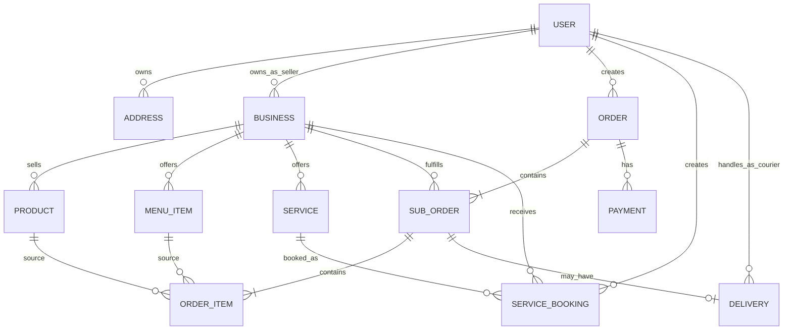
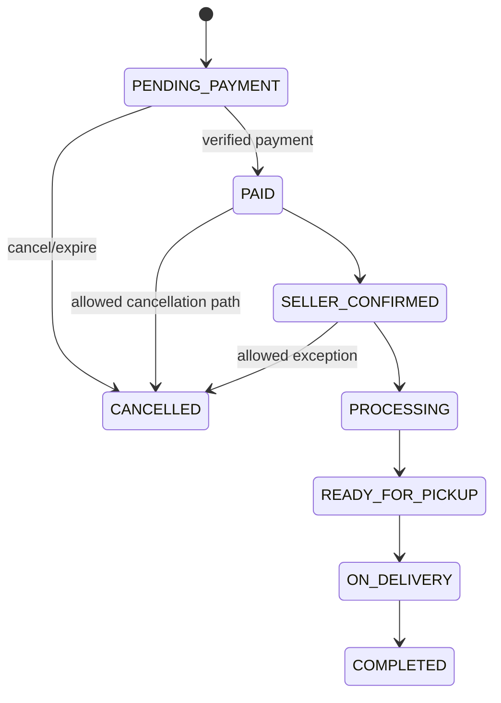
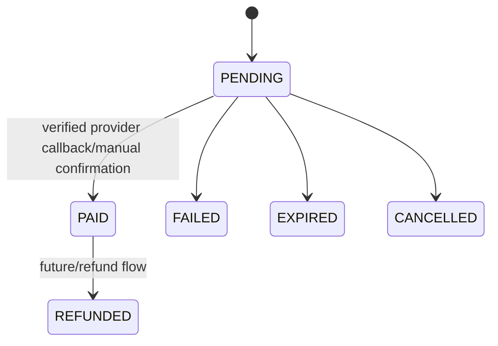
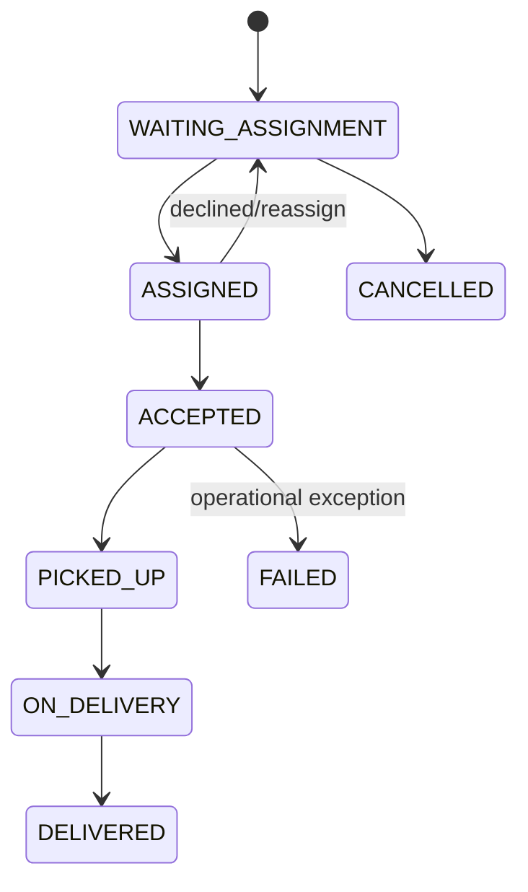
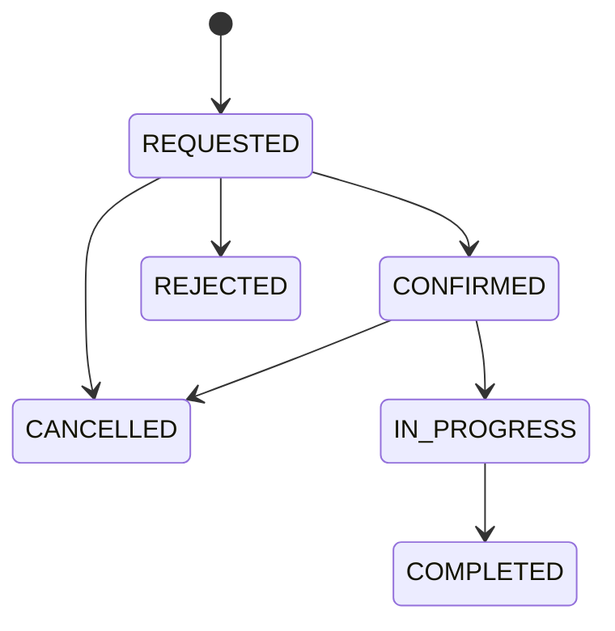

# Design & Technical Specification — PALUGADA Banjarsari

**Document Type:** Product Design + System Design  
**Project:** PALUGADA Banjarsari  
**Version:** 1.0  
**Last Updated:** 28 September 2026  

---

## 1. Design Objective

Dokumen ini menerjemahkan `PRD.md` menjadi rancangan UI/UX, system architecture, data model, route, state machine, integration boundary, dan developer ownership.

Prinsip utama:

1. Transformasi dilakukan bertahap dari existing catalogue app ke transactional marketplace.
2. Existing visual identity PALUGADA dipertahankan.
3. Transactional state tidak boleh bergantung pada client-only logic.
4. UI tidak boleh mengetahui detail persistence Firebase/PostgreSQL.
5. Domain Lukas, Zikri, dan Theo harus dapat berkembang paralel melalui contract yang jelas.
6. Mobile-first untuk customer flow.
7. WhatsApp tetap penting tetapi bukan source of truth.

---

## 2. Existing Technical Baseline

Snapshot repository yang diaudit menggunakan:

```text
Next.js 16.2.9
React 19.2.4
TypeScript 5
Firebase 12.15.0
firebase-admin 14.1.0
Lucide React
XLSX
Vanilla CSS / CSS Modules
```

Existing top-level patterns:

```text
app/
├── (davy)/         # public catalogue pages
├── (theo)/         # auth/admin pages
├── globals.css
└── layout.tsx

context/
├── AuthContext.tsx
└── FavoritesContext.tsx

lib/
├── firebase.ts
├── auth.ts
├── storage.ts
└── firestore/
    ├── analytics.ts
    ├── bisnis.ts
    ├── favorites.ts
    ├── jasa.ts
    ├── kategori.ts
    ├── produk.ts
    ├── reviews.ts
    ├── seo.ts
    └── types.ts
```

Current primary weakness untuk target baru adalah dominannya pola:

```text
Client Component → Firebase SDK → Firestore
```

Pola tersebut tidak boleh menjadi default untuk payment, order, inventory mutation, delivery, dan role-sensitive operation.

---

## 3. Visual Design System

Design system existing dari `agent.md` dipertahankan kecuali ada redesign yang disetujui.

### 3.1 Colors

| Token | Value | Usage |
|---|---|---|
| Primary | `#05472B` | CTA, header, primary action |
| Secondary | `#AADCAB` | secondary surface/highlight |
| Dark | `#013020` | dark background/footer |
| Accent | `#CDFF00` | highlight/status/accent |
| Aqua | `#00C0A3` | icon/active state |
| Black | `#000000` | text/high contrast |
| White | `#FFFFFF` | surface/background/text on dark |

Jangan menambah palette baru secara acak. Semantic states seperti error/warning/success sebaiknya didefinisikan sebagai design token resmi jika dibutuhkan dan disetujui, bukan hardcode per page.

### 3.2 Typography

- Heading: JetBrains Mono
- Body/UI: Plus Jakarta Sans

### 3.3 Layout

- mobile-first;
- 8px spacing system;
- maximum content width desktop yang konsisten;
- sticky bottom action diperbolehkan pada mobile checkout/product/detail;
- seller/admin dashboard dapat menggunakan sidebar desktop + compact navigation mobile.

### 3.4 UI Interaction Rules

Setiap async action harus memiliki:

- loading state;
- success state bila perlu;
- error message yang actionable;
- disabled state untuk mencegah duplicate submission;
- confirmation untuk destructive action.

---

## 4. Information Architecture

### 4.1 Public / Customer

Recommended route map:

```text
/
/katalog
/search
/bisnis
/bisnis/[id]
/produk/[id]
/makanan
/merchant/[id]
/menu/[id]
/jasa
/layanan/[id]
/cart
/checkout
/orders
/orders/[id]
/bookings
/bookings/[id]
/favorites
/profile
/profile/addresses
/login
/register
```

Existing route naming tidak wajib langsung dirombak. Migration harus menjaga URL existing atau memberi redirect bila ada perubahan.

### 4.2 Seller

```text
/seller
/seller/store
/seller/products
/seller/products/new
/seller/products/[id]
/seller/food
/seller/food/menu
/seller/services
/seller/orders
/seller/orders/[id]
/seller/bookings
/seller/analytics
/seller/settings
```

### 4.3 Courier

```text
/courier
/courier/deliveries
/courier/deliveries/[id]
/courier/history
/courier/profile
```

### 4.4 Admin

```text
/admin
/admin/users
/admin/sellers
/admin/couriers
/admin/orders
/admin/payments
/admin/deliveries
/admin/bookings
/admin/categories
/admin/moderation
/admin/analytics
/admin/settings
```

Admin CRUD katalog existing secara bertahap dipindahkan menjadi seller-owned workflow.

---

## 5. Key Screen Design

## 5.1 Home

Tujuan: mengarahkan user ke tiga layanan utama dan discovery lokal.

Section yang direkomendasikan:

1. Header/navigation.
2. Search bar utama.
3. Hero PALUGADA Banjarsari.
4. Tiga primary service cards:
   - Belanja Barang
   - Pesan Makanan
   - Cari Jasa
5. Produk populer.
6. Makanan/merchant populer.
7. Jasa populer.
8. UMKM lokal.
9. Footer.

Existing homepage tidak perlu dibuang; section baru dapat diintegrasikan bertahap.

## 5.2 Product Detail

Minimum content:

- gallery;
- product name;
- price;
- seller identity;
- stock/availability;
- variant bila ada;
- quantity selector;
- add to cart;
- buy now;
- WhatsApp seller secondary action;
- description;
- review.

Mobile action bar:

```text
[Chat WA] [Tambah Keranjang] [Beli]
```

## 5.3 Food Merchant

Minimum content:

- merchant info;
- open/closed;
- delivery context;
- menu category tabs;
- menu item cards;
- floating/current cart summary.

## 5.4 Service Detail

Minimum content:

- provider;
- service description;
- price type/range;
- availability;
- booking CTA;
- WhatsApp CTA;
- rating/review.

Primary action sebaiknya `Booking`, sementara WhatsApp tetap terlihat jelas sebagai secondary/contact action.

## 5.5 Cart

Cart dikelompokkan per seller:

```text
Seller A
[✓] Product A x2
[✓] Product B x1
Subtotal

Seller B
[✓] Product C x1
Subtotal

-----------------
Selected Total
[Checkout]
```

Cart harus menjelaskan item yang unavailable/out-of-stock dan mencegah silent checkout.

## 5.6 Checkout

Section:

1. Address/customer contact.
2. Group per seller.
3. Item summary.
4. Delivery/pickup option jika relevan.
5. Seller notes.
6. Payment method.
7. Cost breakdown.
8. Grand total.
9. Place order CTA.

## 5.7 Seller Dashboard

Dashboard seller tidak hanya angka traffic.

Top cards:

- penjualan periode aktif;
- order selesai;
- order perlu diproses;
- conversion indicator.

Sections:

- sales trend;
- top items;
- order funnel;
- recent orders;
- stock/availability attention;
- traffic & WhatsApp engagement.

## 5.8 Admin Dashboard

Top cards:

- sellers active;
- customers active;
- order volume;
- GMV;
- active deliveries/bookings;
- exception/dispute count.

Admin fokus pada ecosystem health, bukan seller day-to-day CRUD.

---

## 6. Target Architecture

### 6.1 Logical Architecture

```text
┌───────────────────────────────────────┐
│               Next.js UI              │
│ Customer | Seller | Courier | Admin   │
└───────────────────┬───────────────────┘
                    │
                    ▼
┌───────────────────────────────────────┐
│      Route Handler / Server Action    │
│     AuthN/AuthZ + request validation  │
└───────────────────┬───────────────────┘
                    │
                    ▼
┌───────────────────────────────────────┐
│          Application Services         │
│ Order | Payment | Delivery | Booking  │
│ Catalog | Analytics | User/Business   │
└───────────────────┬───────────────────┘
                    │
                    ▼
┌───────────────────────────────────────┐
│          Repository / Gateway         │
│ Firebase repos | Payment adapters     │
│ WhatsApp link | Analytics writer      │
└───────────────────┬───────────────────┘
                    │
                    ▼
┌───────────────────────────────────────┐
│          Current Infrastructure       │
│ Firebase Auth | Firestore | Storage   │
└───────────────────────────────────────┘
```

Future persistence:

```text
Repository interface
       │
       ├── Firebase implementation (now)
       └── PostgreSQL implementation (future VPS)
```

### 6.2 Rule

UI boleh membaca public catalogue melalui mechanism yang efisien, tetapi **mutation kritis** wajib melewati authoritative service boundary.

Critical mutations:

- create order;
- change order status;
- reserve/decrease stock;
- payment state;
- delivery assignment/status;
- service booking status;
- role/ownership changes.

---

## 7. Recommended Project Structure

Tidak wajib dipindahkan sekaligus. Ini target modular structure.

```text
app/
├── (public)/
├── (auth)/
├── seller/
├── courier/
├── admin/
└── api/

modules/
├── catalog/
│   ├── domain/
│   ├── application/
│   └── infrastructure/
├── orders/
├── payments/
├── delivery/
├── bookings/
├── analytics/
├── users/
└── businesses/

components/
├── ui/
├── commerce/
└── shared/

lib/
├── auth/
├── firebase/
├── validation/
└── integrations/

shared/
├── contracts/
├── types/
├── constants/
└── utils/
```

Jangan melakukan big-bang folder refactor. Module baru mengikuti structure target; code existing dipindahkan hanya saat disentuh dan aman.

---

## 8. Domain Ownership Map

```text
LUKAS / ADM
┌─────────────────────────┐
│ analytics               │
│ reporting               │
│ KPI/aggregation         │
│ seller insight          │
│ admin insight           │
└─────────────────────────┘

ZIKRI / ESD
┌─────────────────────────┐
│ web UI                  │
│ reusable UI             │
│ customer/seller UX      │
│ payment integration     │
│ payment presentation    │
└─────────────────────────┘

THEO / ERP
┌─────────────────────────┐
│ orders                  │
│ inventory rule          │
│ fulfillment             │
│ delivery/courier        │
│ service booking         │
│ operational workflow    │
└─────────────────────────┘
```

Shared area:

```text
shared/contracts
shared/types
role definitions
cross-domain event schema
```

Breaking shared change membutuhkan review lintas owner.

---

## 9. Core Data Model

Naming final dapat disesuaikan dengan existing convention. Yang penting adalah entity relationship dan ownership.

### 9.1 Users

```ts
type UserRole = 'customer' | 'seller' | 'courier' | 'admin';

interface User {
  id: string;
  email: string;
  role: UserRole;
  displayName: string | null;
  photoUrl: string | null;
  phone: string | null;
  isActive: boolean;
  createdAt: Date;
  updatedAt: Date;
}
```

### 9.2 Addresses

```ts
interface Address {
  id: string;
  userId: string;
  label: string;
  recipientName: string;
  phone: string;
  addressLine: string;
  areaName: string;
  latitude: number | null;
  longitude: number | null;
  notes: string | null;
  isDefault: boolean;
}
```

### 9.3 Businesses

```ts
type BusinessType = 'RETAIL' | 'FOOD' | 'SERVICE';

interface Business {
  id: string;
  ownerUserId: string;
  name: string;
  types: BusinessType[];
  description: string | null;
  address: string;
  whatsappNumber: string | null;
  logoUrl: string | null;
  isActive: boolean;
  operationalStatus: 'OPEN' | 'CLOSED' | 'PAUSED';
}
```

### 9.4 Retail Products

```ts
interface Product {
  id: string;
  businessId: string;
  categoryId: string;
  name: string;
  description: string | null;
  price: number;
  stock: number;
  sku: string | null;
  imageUrls: string[];
  isActive: boolean;
}
```

Variants dapat ditambahkan melalui child entity `ProductVariant` jika dibutuhkan.

### 9.5 Food Menu

```ts
interface MenuItem {
  id: string;
  businessId: string;
  menuCategoryId: string;
  name: string;
  description: string | null;
  price: number;
  imageUrl: string | null;
  isAvailable: boolean;
}
```

### 9.6 Services

Existing service model dapat diextend:

```ts
interface Service {
  id: string;
  businessId: string;
  categoryId: string;
  name: string;
  description: string | null;
  priceType: 'FIXED' | 'STARTING_FROM' | 'RANGE' | 'CONTACT_PROVIDER';
  minimumPrice: number | null;
  maximumPrice: number | null;
  availabilityType: string;
  isActive: boolean;
}
```

### 9.7 Cart

Cart dapat client-friendly tetapi server wajib revalidate price/stock saat checkout.

```ts
interface CartItem {
  id: string;
  customerId: string;
  itemType: 'PRODUCT' | 'FOOD';
  itemId: string;
  businessId: string;
  quantity: number;
  selectedVariantId: string | null;
}
```

### 9.8 Checkout / Order / Sub-order

Recommended hierarchy:

```text
Order (customer checkout level)
├── OrderGroup / SubOrder seller A
│   └── OrderItem snapshots
└── OrderGroup / SubOrder seller B
    └── OrderItem snapshots
```

```ts
interface Order {
  id: string;
  customerId: string;
  addressSnapshot: object;
  grandTotal: number;
  paymentMethod: string;
  paymentStatus: string;
  status: string;
  createdAt: Date;
}

interface SubOrder {
  id: string;
  orderId: string;
  businessId: string;
  vertical: 'RETAIL' | 'FOOD';
  subtotal: number;
  deliveryFee: number;
  status: string;
}

interface OrderItem {
  id: string;
  subOrderId: string;
  sourceItemId: string;
  itemType: 'PRODUCT' | 'FOOD';
  nameSnapshot: string;
  priceSnapshot: number;
  quantity: number;
  variantSnapshot: object | null;
  lineTotal: number;
}
```

### 9.9 Payments

```ts
interface Payment {
  id: string;
  orderId: string;
  method: 'CASH' | 'BANK_TRANSFER' | 'QRIS' | 'PAYMENT_GATEWAY';
  provider: string | null;
  providerReference: string | null;
  amount: number;
  status: 'PENDING' | 'PAID' | 'FAILED' | 'EXPIRED' | 'CANCELLED' | 'REFUNDED';
  paidAt: Date | null;
  createdAt: Date;
  updatedAt: Date;
}
```

### 9.10 Deliveries

```ts
interface Delivery {
  id: string;
  subOrderId: string;
  courierId: string | null;
  status:
    | 'WAITING_ASSIGNMENT'
    | 'ASSIGNED'
    | 'ACCEPTED'
    | 'PICKED_UP'
    | 'ON_DELIVERY'
    | 'DELIVERED'
    | 'FAILED'
    | 'CANCELLED';
  pickupAddressSnapshot: object;
  destinationAddressSnapshot: object;
  deliveryFee: number;
}
```

### 9.11 Service Bookings

```ts
interface ServiceBooking {
  id: string;
  customerId: string;
  businessId: string;
  serviceId: string;
  requestedAt: Date | null;
  locationSnapshot: object | null;
  notes: string | null;
  priceEstimate: number | null;
  status: 'REQUESTED' | 'CONFIRMED' | 'IN_PROGRESS' | 'COMPLETED' | 'CANCELLED' | 'REJECTED';
}
```

---

## 10. Entity Relationship Overview



Ini adalah conceptual ERD, bukan perintah untuk membuat seluruh collection sekaligus.

---

## 11. Order State Design

### 11.1 Order/Sub-order State



Exact cancellation rule dimiliki Theo dan harus mempertimbangkan payment/refund state.

### 11.2 Food-specific Operational States

Food dapat menggunakan operational state tambahan:

- `ACCEPTED`
- `PREPARING`
- `READY_FOR_PICKUP`

Mapping ke overall order status harus eksplisit.

---

## 12. Payment State Design



Rules:

- payment adapter menghasilkan provider request;
- provider callback masuk ke server endpoint;
- callback diverifikasi;
- update harus idempotent;
- service payment menerbitkan domain event/result untuk order service;
- browser redirect hanya presentation signal, bukan authoritative payment proof.

---

## 13. Delivery State Design



MVP boleh memulai courier assignment dari admin/system-assisted flow sebelum automatic dispatch dibangun.

---

## 14. Service Booking State Design



WhatsApp action tersedia setelah booking created dan tetap tersedia sesuai context.

---

## 15. API / Server Contract Principles

Endpoint exact dapat menyesuaikan Next.js Route Handler/Server Action, tetapi contract domain harus stabil.

Examples:

```text
POST   /api/orders
GET    /api/orders/:id
POST   /api/orders/:id/cancel
POST   /api/sub-orders/:id/status

POST   /api/payments
POST   /api/payments/webhook/:provider

POST   /api/bookings
POST   /api/bookings/:id/confirm
POST   /api/bookings/:id/status

POST   /api/deliveries/:id/accept
POST   /api/deliveries/:id/status

GET    /api/seller/analytics
GET    /api/admin/analytics
```

Rules:

- validate authentication;
- validate role;
- validate resource ownership;
- validate input;
- return predictable error shape;
- do not leak internal exception/secret;
- make critical write idempotent when applicable.

Suggested response envelope:

```ts
interface ApiResponse<T> {
  data?: T;
  error?: {
    code: string;
    message: string;
    fieldErrors?: Record<string, string>;
  };
}
```

---

## 16. Repository Interface Strategy

New critical modules should depend on interface/application service, not directly on `firebase/firestore` from UI.

Concept:

```ts
interface OrderRepository {
  createOrder(input: CreateOrderData): Promise<Order>;
  getOrderById(id: string): Promise<Order | null>;
  updateSubOrderStatus(id: string, status: SubOrderStatus): Promise<void>;
}
```

Current:

```text
FirestoreOrderRepository
```

Future:

```text
PostgresOrderRepository
```

Application service tetap sama.

---

## 17. Authentication & Authorization Design

### 17.1 Authentication

Firebase Auth tetap digunakan pada current phase.

### 17.2 Authorization

Authorization harus memeriksa role + ownership.

Examples:

```text
Customer
- read own orders/bookings
- create own checkout/booking

Seller
- manage business where ownerUserId == currentUser.id
- read/update sub-order for owned business

Courier
- read/update assigned delivery only

Admin
- platform monitoring/governance actions only
```

Client route guard hanyalah UX. Security tetap harus enforced pada server/rules.

---

## 18. Firebase Security Direction

Production tidak boleh bergantung pada test mode.

Security plan minimal:

1. public catalogue read sesuai active data;
2. user profile private write milik sendiri;
3. seller write dibatasi owner;
4. direct client write untuk transactional collections diminimalkan/dilarang;
5. payment state hanya server-authoritative;
6. admin claim/role tidak dapat dinaikkan dari client.

Rules harus berada di version control ketika sudah diterapkan, bukan hanya Firebase Console manual.

---

## 19. Payment Integration Adapter

Zikri mengimplementasikan provider melalui abstraction.

```ts
interface PaymentGateway {
  createTransaction(input: CreatePaymentInput): Promise<PaymentTransaction>;
  verifyWebhook(input: WebhookInput): Promise<VerifiedPaymentEvent>;
}
```

Application service tidak boleh mengetahui detail signature/vendor field lebih dari yang dibutuhkan.

Vendor selection dilakukan terpisah.

---

## 20. WhatsApp Integration Design

Tidak perlu WhatsApp Business API untuk MVP jika deep-link sudah memenuhi kebutuhan.

Flow:

```text
Order/Booking exists
      ↓
Generate safe message context
      ↓
Track WHATSAPP_CLICK
      ↓
Open wa.me / WhatsApp URL
```

Message tidak boleh berisi secret/payment credential.

Nomor harus dinormalisasi ke format yang dapat digunakan oleh WhatsApp.

---

## 21. Analytics Architecture — Lukas

### 21.1 Two Data Classes

**Transactional truth:**

- orders;
- payments;
- deliveries;
- bookings.

**Behavioral events:**

- views;
- add to cart;
- checkout started;
- WhatsApp click;
- funnel interaction.

KPI finansial harus berasal dari transactional truth, bukan semata event clickstream.

### 21.2 Event Shape

Recommended:

```ts
interface AnalyticsEventV2 {
  id: string;
  name: string;
  version: number;
  occurredAt: Date;
  userId: string | null;
  sessionId: string | null;
  businessId: string | null;
  entityType: string | null;
  entityId: string | null;
  orderId: string | null;
  metadata: Record<string, string | number | boolean | null>;
}
```

Avoid storing PII yang tidak diperlukan di analytics event.

### 21.3 Seller Analytics Query Boundary

Seller analytics harus selalu scoped by `businessId` yang seller miliki.

### 21.4 Platform Analytics

Admin dapat aggregate cross-business dengan permission yang sesuai.

---

## 22. Cross-Domain Contracts

### Payment → Order

Payment service boleh menghasilkan:

```ts
PAYMENT_CONFIRMED {
  orderId,
  paymentId,
  amount,
  paidAt
}
```

Theo menentukan effect terhadap order state.

### Order → Analytics

Order domain menghasilkan descriptive event seperti:

```ts
ORDER_CREATED
ORDER_COMPLETED
ORDER_CANCELLED
```

Lukas menentukan aggregation/KPI, bukan state transition order.

### Delivery → Order

Delivery domain menghasilkan delivery status event. Mapping ke order completion didefinisikan di business service Theo.

---

## 23. UI Component Boundaries

Recommended reusable components:

```text
Button
Input
Select
Modal
Drawer
Badge
Toast/Alert
EmptyState
LoadingState
ErrorState
ProductCard
MerchantCard
ServiceCard
PriceDisplay
QuantitySelector
CartSellerGroup
OrderStatusBadge
PaymentStatusBadge
DeliveryStatusBadge
MetricCard
ChartContainer
```

Shared component modification tidak boleh merusak page milik developer lain. Gunakan props backward-compatible atau coordinate breaking change.

---

## 24. Error and Edge Cases

Wajib didesain:

- item deleted setelah masuk cart;
- price berubah sebelum checkout;
- stock berkurang sebelum checkout;
- seller inactive;
- merchant closed;
- duplicate checkout submission;
- duplicate payment webhook;
- payment berhasil tetapi UI terputus;
- courier menolak assignment;
- seller menolak booking;
- WhatsApp number invalid;
- failed image upload;
- unauthorized role access;
- order dari multiple seller dengan status berbeda.

UI harus menampilkan state per seller/sub-order, bukan hanya satu status yang menyesatkan.

---

## 25. Testing Strategy

### 25.1 Unit Tests

Prioritas:

- order total calculation;
- multi-seller grouping;
- state transition validation;
- payment status mapping;
- delivery transition;
- booking transition;
- analytics KPI calculation.

### 25.2 Integration Tests

Prioritas:

- create order from cart;
- stock validation;
- payment callback → payment status → order state;
- seller authorization;
- courier authorization;
- booking → WhatsApp context;
- analytics event emission.

### 25.3 E2E Critical Path

At minimum:

1. customer login → product → cart → checkout → order;
2. seller login → view/confirm order;
3. payment sandbox/manual flow;
4. food order → courier flow → delivered;
5. service booking → provider confirmation → complete.

---

## 26. Performance Design

- paginate catalogue/admin tables;
- avoid analytics `limit(1000)` becoming permanent scaling strategy;
- derive/aggregate metrics when volume requires it;
- optimize images;
- prefer server rendering where useful;
- only use client components where interaction requires it;
- do not fetch whole collections for simple detail/list queries.

---

## 27. Observability

For critical server action log at minimum:

- request correlation/order ID;
- action name;
- actor role/id when safe;
- result;
- error code;
- provider reference for payment (non-secret).

Never log:

- password;
- token;
- secret key;
- raw payment credential.

---

## 28. Migration Strategy from Existing Code

### Step 1 — Stabilize

- document baseline;
- ensure Git tree clean/understood;
- confirm current build/lint;
- preserve working catalogue.

### Step 2 — Introduce New Roles

Migrate `pelanggan` → `customer` with backward compatibility during transition.

### Step 3 — Introduce Ownership

Add `ownerUserId` / seller ownership relation to business.

### Step 4 — Introduce Server Boundary

New critical mutations use service/API layer first. Existing public reads can remain temporarily.

### Step 5 — Build Transactional Domains

Order/payment/delivery/booking are created as new modules rather than stuffed into old product helper files.

### Step 6 — Move Seller CRUD

Existing admin CRUD capabilities that are seller responsibilities move to seller dashboard.

### Step 7 — Expand Analytics

Existing event system becomes V2/extended while preserving historical compatibility where feasible.

### Step 8 — VPS Readiness

Once domain contracts are stable, implement persistence migration plan to PostgreSQL.

---

## 29. Branch and File Safety

Long-lived branch ownership:

```text
lukas → Lukas
zikri → Zikri
theo  → Theo
```

No developer/agent may:

- checkout another developer branch and commit there without explicit instruction;
- merge another developer branch directly;
- reset/rebase shared branch destructively;
- delete unrelated files to “clean” the project;
- auto-resolve conflicts by discarding unknown work;
- auto-push unless explicitly requested.

Integration path uses `develop` then `main`.

---

## 30. Repository Baseline Warning

Pada snapshot yang diaudit, Git menunjukkan beberapa file tracked di folder `UI Katalog v1/` sebagai deleted. Ini harus diperlakukan sebagai **pre-existing working-tree condition** sampai dipastikan.

Agent/developer tidak boleh:

- commit deletion tersebut secara tidak sengaja;
- restore/overwrite tanpa memahami baseline;
- menggunakan kondisi tersebut sebagai alasan melakukan mass cleanup.

Sebelum implementation besar, status baseline harus diselesaikan dan disepakati.

---

## 31. Do Not Do

- Jangan membuat semua domain dalam satu file helper Firestore besar.
- Jangan menaruh secret payment di `NEXT_PUBLIC_*`.
- Jangan mempercayai role dari browser untuk authorization.
- Jangan menjadikan analytics event sebagai sumber payment truth.
- Jangan menjadikan WhatsApp sebagai satu-satunya histori order.
- Jangan melakukan big-bang Firebase → PostgreSQL migration sebelum domain stabil.
- Jangan memindahkan semua folder existing hanya demi mengikuti target structure.
- Jangan mengubah UI palette/font tanpa keputusan design.
- Jangan menambahkan library besar jika native/stack existing sudah cukup.
- Jangan mengerjakan domain developer lain tanpa contract/review.

---

## 32. Design Principle Summary

> **UI dibuat familiar dan mobile-first; state transaksi authoritative di server/service layer; data ownership mengikuti seller/customer/courier; analytics membaca fakta transaksi tanpa mengendalikan business process; dan arsitektur disusun agar Firebase dapat diganti kemudian tanpa menulis ulang keseluruhan aplikasi.**
