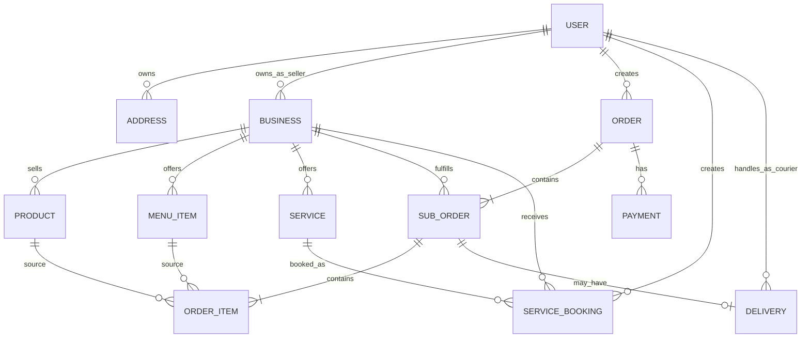
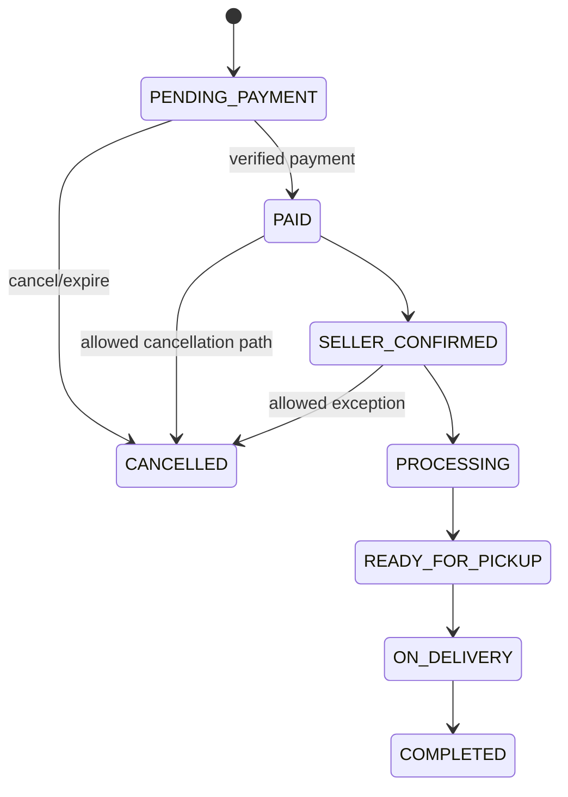
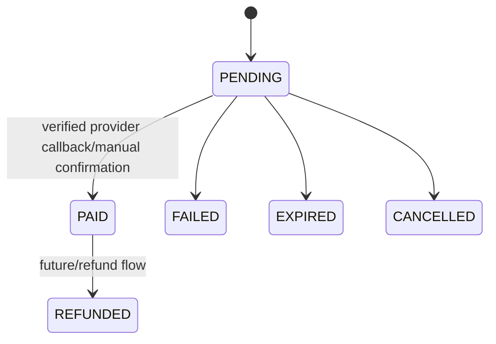
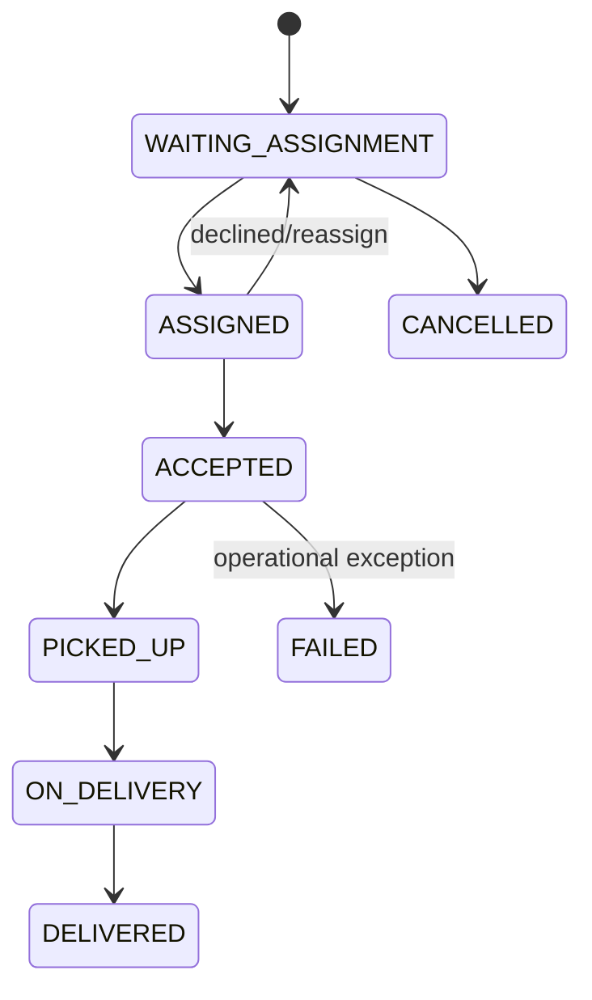
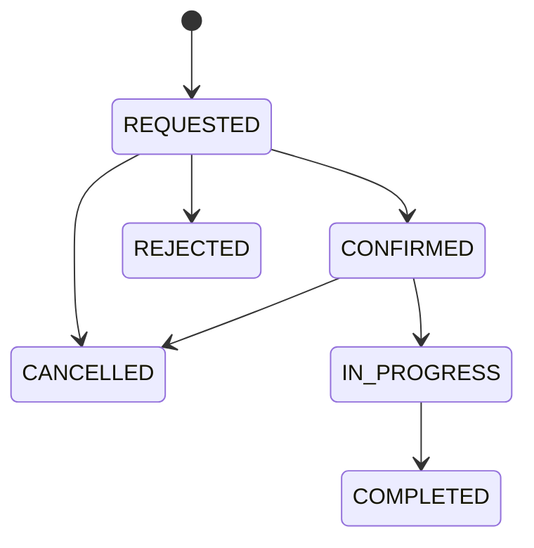

# Design & Technical Specification — PALUGADA Banjarsari

**Document Type:** Product Design + System Design
**Project:** PALUGADA Banjarsari
**Version:** 1.4
**Last Updated:** 29 September 2026

---

## 1. Design Objective

**Status implementasi terbaru:** pembaruan UI customer dan monitoring admin dengan akun uji lokal.
Bagian 2–32 tetap menjadi rancangan target, bukan klaim bahwa seluruh PRD sudah diimplementasikan.
Lihat bagian 36 untuk hasil redesign terbaru; bagian 34 menjelaskan forecasting, transaksi demo, dan akses LAN. Bagian 33 merupakan catatan tahap pertama dan digantikan oleh bagian 34 jika berbeda.

Dokumen ini menerjemahkan `PRD.md` menjadi rancangan UI/UX, system architecture, data model, route, state machine, integration boundary, dan developer ownership.

Prinsip utama:

1. Transformasi dilakukan bertahap dari existing catalogue app ke transactional marketplace.
2. Identitas merek PALUGADA dipertahankan, tetapi customer UI direstrukturisasi menggunakan pola interaksi dari referensi Astro, Shopee/ShopeeFood, dan Gojek tanpa menyalin identitas visual mereka.
3. Transactional state tidak boleh bergantung pada client-only logic.
4. UI tidak boleh mengetahui detail persistence Firebase/PostgreSQL.
5. Domain Lukas, Zikri, dan Theo harus dapat berkembang paralel melalui contract yang jelas.
6. Mobile-first untuk customer flow.
7. WhatsApp tetap penting tetapi bukan source of truth.

---

## 2. Existing Technical Baseline

Snapshot repository yang diaudit menggunakan:

```text
Next.js 16.2.9
React 19.2.4
TypeScript 5
Firebase 12.15.0
firebase-admin 14.1.0
Lucide React
XLSX
Vanilla CSS / CSS Modules
```

Existing top-level patterns:

```text
app/
├── (storefront)/   # customer marketplace and profile pages
├── (workspace)/    # admin monitoring and Firebase management
├── (auth)/         # login and registration
├── globals.css
└── layout.tsx

context/
├── AuthContext.tsx
└── FavoritesContext.tsx

lib/
├── firebase.ts
├── auth.ts
├── storage.ts
└── firestore/
    ├── analytics.ts
    ├── bisnis.ts
    ├── favorites.ts
    ├── jasa.ts
    ├── kategori.ts
    ├── produk.ts
    ├── reviews.ts
    ├── seo.ts
    └── types.ts
```

Current primary weakness untuk target baru adalah dominannya pola:

```text
Client Component → Firebase SDK → Firestore
```

Pola tersebut tidak boleh menjadi default untuk payment, order, inventory mutation, delivery, dan role-sensitive operation.

---

## 3. Visual Design System

### 3.0 Reference-driven design direction

Customer UI PALUGADA menggunakan screenshot referensi yang diberikan sebagai **inspirasi pola interaksi**, bukan sebagai template yang disalin mentah.

| Referensi | Pola yang diadopsi | Adaptasi untuk PALUGADA |
|---|---|---|
| Astro | search-first grocery experience, product grid yang cepat dipindai, cart/order empty state, promo screen, bottom navigation sederhana | dipakai untuk katalog barang, keranjang, pesanan, promo, dan profil |
| Shopee / ShopeeFood | discovery yang kaya, kategori horizontal, promo/deal module, merchant/menu browsing, multi-seller commerce | dipakai untuk marketplace barang, food discovery, merchant card, voucher/promo, dan grouping seller |
| Gojek | location-first flow, map/location picker, bottom sheet, satu CTA utama yang jelas, booking/service journey | dipakai untuk alamat, pengantaran, pemilihan lokasi, booking jasa, dan delivery tracking |

**Design rule:** PALUGADA harus terasa familiar bagi pengguna aplikasi commerce Indonesia, tetapi tetap memakai identitas Banjarsari dan warna PALUGADA. Jangan menyalin logo, icon proprietary, layout pixel-perfect, ilustrasi, campaign visual, atau trade dress aplikasi referensi.

Target karakter visual:

- lokal dan ramah;
- cepat dipahami oleh pengguna non-teknis;
- mobile-first dan touch-friendly;
- commerce-dense tetapi tidak berantakan;
- whitespace cukup untuk hierarchy;
- CTA utama selalu jelas;
- promo terlihat hidup tetapi tidak menutupi fungsi utama;
- visual Banjarsari/UMKM dapat muncul pada banner/empty state/illustration tanpa mengganggu transaksi.

### 3.1 Color system

PALUGADA tetap **green-first**. Warna referensi tidak diambil sebagai warna brand utama.

| Token | Value | Usage |
|---|---|---|
| Brand / Primary | `#05472B` | CTA utama, active navigation, price emphasis tertentu, seller/customer action |
| Brand Dark | `#013020` | text/header gelap, desktop sidebar, high-emphasis surface |
| Brand Soft | `#AADCAB` | chip, selected surface, secondary highlight |
| Accent Lime | `#CDFF00` | badge, promo highlight kecil, attention accent |
| Aqua | `#00C0A3` | info, tracking accent, secondary interactive state |
| Commerce Orange | `#FF7A1A` | promo/deal, food highlight, discount; **bukan** warna global navigation |
| Background | `#F6F7F5` | app background |
| Surface | `#FFFFFF` | card, sheet, navbar, form |
| Border | `#E5E9E6` | divider/card border |
| Text Primary | `#161A17` | body/headline utama |
| Text Secondary | `#69716B` | helper/metadata |
| Success | `#15803D` | successful state |
| Warning | `#D97706` | attention state |
| Error | `#DC2626` | destructive/error state |

Rules:

- halaman customer mayoritas menggunakan background putih / off-white;
- green menjadi anchor brand; orange hanya accent commerce/promo;
- jangan membuat tiap vertical memiliki brand color berbeda secara ekstrem;
- warna status transactional tidak boleh bergantung pada warna saja; tetap gunakan label/icon;
- contrast text/CTA minimal mengikuti WCAG AA bila memungkinkan.

### 3.2 Typography

Untuk customer-facing marketplace, **Plus Jakarta Sans menjadi font utama untuk heading dan body** agar lebih dekat dengan karakter aplikasi commerce modern dan lebih mudah dipindai di layar kecil.

- Customer heading/display: Plus Jakarta Sans 600–800.
- Customer body/UI: Plus Jakarta Sans 400–700.
- Seller/admin analytics dan order ID: JetBrains Mono boleh dipakai secara selektif untuk angka, code, ID, atau data teknis.
- Hindari JetBrains Mono sebagai heading utama customer karena memberi kesan terlalu teknis.

Recommended mobile scale:

| Role | Size | Weight |
|---|---:|---:|
| Hero title | 28–32 px | 700–800 |
| Page title | 20–24 px | 700 |
| Section title | 18–20 px | 700 |
| Card title | 14–16 px | 600–700 |
| Body | 14–16 px | 400–500 |
| Caption/meta | 11–13 px | 400–600 |
| Price | 16–20 px | 700–800 |

### 3.3 Layout and spacing

Base rules:

- mobile-first;
- 4px base grid dengan spacing utama 8 / 12 / 16 / 20 / 24 / 32;
- mobile content padding 16px; promo/banner dapat edge-to-edge bila desain membutuhkan;
- minimum touch target 44×44px;
- card radius 12–16px;
- modal/bottom sheet radius atas 20–24px;
- subtle shadow hanya untuk floating/sheet/elevated card;
- divider tipis lebih disukai daripada shadow berat;
- product grid customer: 2 kolom pada mobile, 3–4 tablet, 4–6 desktop sesuai container;
- seller/admin desktop dapat menggunakan sidebar; customer desktop menggunakan top navigation + content container;
- sticky bottom CTA diperbolehkan pada product detail, checkout, booking, dan delivery selection.

### 3.4 Global customer app shell

Mobile shell PALUGADA mengikuti mental model Astro/Shopee: **header kontekstual + content + fixed bottom navigation**.

Default bottom navigation:

```text
[Beranda] [Promo] [Keranjang] [Pesanan] [Akun]
```

Rules:

- 5 item maksimum;
- active item memakai `Brand / Primary` dan label terlihat;
- cart dapat memiliki numeric badge;
- promo dapat memiliki dot indicator bila ada campaign baru;
- navigation tidak ditampilkan pada full-screen checkout/payment/location picker bila mengganggu task;
- desktop mengganti bottom nav dengan header/navigation yang sesuai, tidak memperbesar bottom nav.

Header customer memiliki tiga variant:

1. **Home header** — delivery/address context + notification + search.
2. **Listing header** — back/search/filter/sort sesuai konteks.
3. **Transaction header** — back + page title, tanpa elemen promo yang mengganggu.

### 3.5 Search pattern

Search adalah primary discovery control.

Home:

```text
Dikirim ke: [Alamat aktif ▾]                    [🔔]
[ 🔍 Cari produk, makanan, atau jasa... ]
```

Listing:

```text
[←] [ 🔍 Cari di kategori ini... ] [Filter]
```

Search suggestions dapat menampilkan:

- recent search;
- kategori;
- product/merchant/service suggestion;
- popular local query.

### 3.6 Cards and commerce density

**ProductCard** customer mengikuti prinsip kartu Astro: gambar dominan, informasi ringkas, CTA cepat.

Urutan visual:

```text
[image]
[badge/promo optional]
Product name (max 2 lines)
Rp price
Seller / area (optional)
Stock/delivery info
[ + ] quick add
```

**MerchantCard** mengikuti pola food marketplace:

```text
[merchant image]
Merchant name
rating • distance/area • ETA
promo/delivery badge
```

**ServiceCard** mengikuti pola service marketplace:

```text
[service image/icon]
Service name
Provider
Mulai dari Rp...
availability/area
```

Rules:

- product card mobile tidak boleh penuh dengan lebih dari 3 badge sekaligus;
- harga dan CTA lebih menonjol daripada metadata;
- nama maksimal 2 baris pada grid;
- skeleton mengikuti shape card final untuk mengurangi layout shift.

### 3.7 Promotional surfaces

Promo mengadopsi energi visual Astro/Shopee tetapi tetap PALUGADA.

Jenis:

- hero promo banner;
- voucher card;
- flash/deal strip;
- free-delivery / local promo badge;
- seller campaign card.

Rules:

- promo tidak boleh mengambil >40% viewport pertama terus-menerus;
- satu hero banner utama per viewport;
- CTA promo jelas;
- countdown hanya jika benar-benar berasal dari waktu campaign server;
- jangan membuat fake urgency.

### 3.8 Empty, loading, and feedback states

Mengikuti kualitas empty state Astro: jelas, ramah, dan selalu menawarkan next action.

Pattern:

```text
[illustration / future PALUGADA mascot]
Title
Short explanation
[Primary CTA]
[Optional recommendations]
```

Contoh:

```text
Belum ada pesanan
Mulai jelajahi produk, makanan, atau jasa di Banjarsari.
[Mulai Jelajah]
```

Loading:

- skeleton untuk grid/list;
- spinner hanya untuk action pendek;
- full-page blank loading dihindari.

### 3.9 Iconography and imagery

- gunakan Lucide React atau satu icon family konsisten;
- default stroke 1.8–2px, 20–24px;
- active bottom-nav icon boleh menggunakan filled/stronger visual treatment jika tersedia;
- product photo memakai real seller image;
- campaign illustration harus memiliki source/ownership yang jelas;
- maskot PALUGADA belum diputuskan; jangan menjadikan referensi maskot sebelumnya sebagai asset final.

### 3.10 Motion

- micro-interaction 150–220ms;
- bottom sheet 220–300ms;
- add-to-cart boleh memiliki lightweight confirmation animation;
- hindari parallax/large animation yang memperlambat device entry-level;
- respect `prefers-reduced-motion`.

### 3.11 UI interaction rules

Setiap async action harus memiliki:

- loading state;
- success feedback bila relevan;
- actionable error message;
- disabled state untuk mencegah duplicate submission;
- confirmation untuk destructive action;
- optimistic update hanya jika rollback aman;
- sticky CTA tidak boleh menutupi konten terakhir (tambahkan safe-area/padding bawah).

---

## 4. Information Architecture

### 4.1 Public / Customer

Recommended route map:

```text
/
/katalog
/search
/promo
/bisnis
/bisnis/[id]
/produk/[id]
/makanan
/merchant/[id]
/menu/[id]
/jasa
/layanan/[id]
/cart
/checkout
/orders
/orders/[id]
/bookings
/bookings/[id]
/favorites
/profile
/profile/addresses
/login
/register
```

Existing route naming tidak wajib langsung dirombak. Migration harus menjaga URL existing atau memberi redirect bila ada perubahan.

Mobile bottom navigation maps to:

```text
Beranda   → /
Promo     → /promo
Keranjang → /cart
Pesanan   → /orders (dengan akses booking dari tab/segment)
Akun      → /profile
```

`/makanan`, `/jasa`, dan `/katalog` tetap menjadi vertical discovery utama dari Home/Search, bukan wajib menjadi bottom-nav item.

### 4.2 Seller

```text
/seller
/seller/store
/seller/products
/seller/products/new
/seller/products/[id]
/seller/food
/seller/food/menu
/seller/services
/seller/orders
/seller/orders/[id]
/seller/bookings
/seller/analytics
/seller/settings
```

### 4.3 Courier

```text
/courier
/courier/deliveries
/courier/deliveries/[id]
/courier/history
/courier/profile
```

### 4.4 Admin

```text
/admin
/admin/users
/admin/sellers
/admin/couriers
/admin/orders
/admin/payments
/admin/deliveries
/admin/bookings
/admin/categories
/admin/moderation
/admin/analytics
/admin/settings
```

Admin CRUD katalog existing secara bertahap dipindahkan menjadi seller-owned workflow.

---

## 5. Key Screen Design

### 5.0 Customer journey model

PALUGADA tidak membuat tiga aplikasi terpisah. Customer bergerak melalui satu shell aplikasi dengan tiga vertical:

```text
                     ┌──────────────┐
                     │   BERANDA    │
                     └──────┬───────┘
                            │
              ┌─────────────┼─────────────┐
              ▼             ▼             ▼
        Belanja Barang  Pesan Makanan   Cari Jasa
              │             │             │
              ▼             ▼             ▼
          Product       Merchant/Menu   Service/Provider
              │             │             │
              └─────┬───────┘             │
                    ▼                     ▼
                  Cart                 Booking
                    │                     │
                 Checkout                 │
                    │                     │
                 Payment                  │
                    │                     │
                    └─────────┬───────────┘
                              ▼
                       Pesanan/Aktivitas
```

Barang dan makanan dapat masuk cart. Jasa memakai booking flow karena jadwal/lokasi/negosiasi detail berbeda.

### 5.1 Home — PALUGADA discovery hub

Inspirasi utama: **Astro home + Shopee discovery**, dengan warna PALUGADA.

Above-the-fold mobile:

```text
┌─────────────────────────────────┐
│ Dikirim ke                      │
│ Desa/Kp... Banjarsari ▾      🔔 │
│                                 │
│ [ 🔍 Cari apa di Banjarsari? ] │
├─────────────────────────────────┤
│ [ Promo / campaign banner ]     │
├─────────────────────────────────┤
│  🛍 Barang   🍜 Makanan   🛠 Jasa │
│  🏪 UMKM     🏷 Promo     ⋯      │
└─────────────────────────────────┘
```

Urutan section default:

1. address/delivery context;
2. search bar;
3. hero promo/banner;
4. quick service/category grid;
5. `Pilihan untukmu` product horizontal/grid;
6. `Kuliner Banjarsari` merchant horizontal;
7. `Jasa di sekitar` service list;
8. `Promo hari ini`;
9. `UMKM lokal`;
10. recently viewed bila ada.

Rules:

- Home bukan landing page marketing panjang; ia adalah operational commerce screen.
- Search + kategori harus terlihat tanpa scroll panjang.
- Banner dapat swipe carousel, maksimum 3 campaign aktif.
- Setiap section memiliki `Lihat Semua` bila punya listing penuh.
- Personal greeting opsional, tetapi tidak boleh mengambil ruang lebih besar daripada search/discovery.

### 5.2 Promo

Inspirasi utama: **Astro Promo + Shopee campaign module**.

Structure:

```text
[Header: Promo]
[Hero promo]

Promo Untukmu                     [Lihat semua]
[Voucher] [Voucher] [Voucher]

[Tabs: Semua | Barang | Makanan | Jasa]

[Deal / campaign cards]
[Discounted product grid]
```

Voucher card minimum:

- title;
- benefit;
- minimum spend/terms ringkas;
- expiry;
- `Gunakan` CTA;
- detail terms via drawer/modal.

Promo eligibility dihitung dari server/domain rule pada implementasi produksi; UI tidak menentukan sendiri voucher valid.

### 5.3 Product catalogue / search results

Inspirasi utama: **Astro product grid + Shopee search/filter**.

Header:

```text
[← optional] [ 🔍 pencarian........................ ] [filter]
[Category chips horizontal]
[Sort: Relevan ▾] [Area] [Harga] [Tersedia]
```

Grid mobile: 2 kolom.

Product card wajib menampilkan:

- image 1:1;
- product name max 2 baris;
- current price;
- original price/discount hanya bila valid;
- seller/UMKM name atau area dalam satu line kecil;
- availability/delivery info bila diketahui;
- quick add `+` jika produk langsung dapat ditambahkan.

Tidak perlu meniru density Shopee secara penuh; readability untuk pengguna lokal lebih penting daripada memaksimalkan jumlah badge.

### 5.4 Product detail

Target structure:

```text
[←]                             [♡] [cart]
[Product image carousel]

Product name
Rp price         [discount badge]
Rating • Terjual • Stock

[Toko / Seller card]                    [Lihat toko]

Variant
[chip] [chip] [chip]
Quantity [-] 1 [+]

Description
Delivery estimate / pickup option
Review preview

-----------------------------------------
[Chat WA] [Tambah Keranjang] [Beli Sekarang]
```

Rules:

- `Beli Sekarang` primary;
- `Tambah Keranjang` secondary-strong;
- WhatsApp tertiary/contact action tetapi selalu discoverable;
- CTA bottom bar sticky pada mobile;
- stock/price selalu revalidated di server saat checkout;
- review verified status harus jelas jika nanti tersedia.

### 5.5 Food discovery

Inspirasi utama: **ShopeeFood** dengan kebersihan visual Astro.

Top:

```text
[←] [Alamat pengantaran ▾]                  [cart]
[ 🔍 Cari makanan atau warung... ]

[Category icons horizontally scrollable]
[Promo food banner]
```

Recommended sections:

- Dekat kamu / area Banjarsari;
- Promo makan;
- Populer;
- Siap cepat;
- Berdasarkan kategori: Nasi, Minuman, Jajanan, dll;
- merchant list.

Merchant card:

```text
[photo]
Nama Warung
★ 4.8 • Area • ~25 menit
Rp delivery / Pickup tersedia
[promo badge]
```

ETA tidak boleh ditampilkan sebagai angka pasti jika backend belum mampu menghitungnya. Gunakan label seperti `Estimasi belum tersedia` daripada data palsu.

### 5.6 Food merchant / menu

```text
[Merchant cover]
Nama merchant
Status buka • area • delivery/pickup
[Chat merchant]

[🔍 Cari menu]
[Menu category tabs sticky]

Makanan
[image] Nasi ...             Rp... [+]
[image] Ayam ...             Rp... [+]

Minuman
...

[Cart summary: 3 item • Rp... ] [Lihat Keranjang]
```

Rules:

- category tabs menjadi sticky saat scroll;
- add menu item menggunakan plus button cepat;
- modifier/variant membuka bottom sheet;
- sold-out item tetap boleh terlihat tetapi disabled dengan label `Habis`;
- satu merchant card/menu tidak boleh mencampur produk retail kecuali business memang punya dua vertical dan UI menjelaskannya.

### 5.7 Service discovery

Inspirasi utama: **Gojek service entry** tetapi bukan clone transport app.

Home jasa:

```text
[Alamat layanan aktif ▾]
[ 🔍 Cari jasa... ]

[Cleaning] [Servis] [Antar] [Lainnya]

Jasa populer
[Service cards]

Penyedia dekat area kamu
[Provider cards]
```

Service card menonjolkan `nama layanan`, `provider`, `harga mulai`, `area layanan`, dan `slot/availability` bila tersedia.

### 5.8 Service detail / booking

Inspirasi utama: **Gojek booking flow** — satu keputusan per langkah, CTA besar di bawah.

```text
[←] Jasa

[Service image]
Nama jasa
Provider • rating
Mulai dari Rp...

Lokasi layanan
[Alamat aktif] [Ubah]

Jadwal
[Tanggal] [Jam]

Catatan
[textarea]

[Chat via WhatsApp]

-----------------------------------
[Booking Sekarang]
```

Booking dibuat di PALUGADA terlebih dahulu. Setelah booking ID tersedia, WhatsApp dapat membuka pesan dengan context booking tersebut.

### 5.9 Location picker / delivery context

Inspirasi utama: **Gojek set lokasi jemput/map flow**.

Use cases:

- alamat delivery product/food;
- alamat jasa;
- pickup/store location;
- courier tracking di masa depan.

Pattern:

```text
[×] Pilih lokasi
[ 🔍 Cari alamat / nama tempat ]

[Gunakan lokasi saat ini]
[Pilih lewat peta]

Alamat tersimpan
[Rumah]
[Kantor]
[+ Tambah alamat]
```

Jika map dipakai:

- map menjadi canvas utama;
- pin center/selected point jelas;
- bottom sheet berisi address confirmation;
- CTA `Gunakan Lokasi Ini` sticky;
- permission location diminta hanya saat relevan, bukan pada first app load.

### 5.10 Cart

Inspirasi utama: **Astro cart**, tetapi harus mendukung multi-seller.

Empty state:

```text
[illustration]
Belum ada barang
Yuk pilih produk atau makanan yang kamu suka.
[Mulai Jelajah]

Mungkin kamu tertarik
[recommended product grid]
```

Filled state:

```text
Keranjang

[✓] Seller A
    [✓] Product A   [-] 2 [+]   Rp...
    [✓] Product B   [-] 1 [+]   Rp...
    Catatan toko

[✓] Seller B
    [✓] Product C   [-] 1 [+]   Rp...

-----------------------------------------
[Select all]  Total Rp...      [Checkout]
```

Rules:

- grouped by seller;
- selection per item/per seller;
- unavailable item dijelaskan, tidak silently removed;
- quantity update memiliki optimistic UX tetapi revalidate server pada checkout;
- recommendations boleh tampil setelah cart, bukan menyela antar-seller group.

### 5.11 Checkout

Checkout mengikuti prinsip **task-focused**, bukan discovery.

```text
[←] Checkout

Alamat Pengiriman
[Recipient, phone]
[Address]                                      [Ubah]

Seller A
[item summary]
Pengiriman: [Diantar ▾]
Catatan: [...]

Seller B
...

Voucher/Promo                               [Pilih]
Pembayaran                                  [Pilih]

Ringkasan
Subtotal
Ongkir
Diskon
Total

-----------------------------------------
Total Rp...                    [Buat Pesanan]
```

Rules:

- tidak ada banner promo besar di checkout;
- cost breakdown eksplisit;
- one checkout can create multiple sub-order;
- seller/delivery state dipisahkan setelah order dibuat;
- `Buat Pesanan` disabled selama request berjalan;
- payment proof tidak ditentukan dari browser redirect semata.

### 5.12 Orders / activity

Inspirasi utama: **Astro Riwayat Belanja + Shopee Pesanan Saya**.

Default screen:

```text
Pesanan
[Semua] [Diproses] [Dikirim] [Selesai] [Batal]
```

Empty state per tab mengikuti pattern illustration + CTA.

Order card:

```text
Seller A                         [Diproses]
[item thumbnail] Product ... x2
+1 item lain
Total Rp...
[Detail] [Hubungi Seller]
```

Untuk multi-seller checkout, `/orders/[checkoutId]` dapat menampilkan parent checkout dan status masing-masing sub-order.

### 5.13 Order detail / delivery tracking

Order detail fokus pada timeline:

```text
Status: Sedang diproses
○ Pesanan dibuat
● Pembayaran berhasil
○ Diproses seller
○ Siap diambil kurir
○ Dalam perjalanan
○ Selesai
```

Jika location tracking tersedia pada fase berikutnya, map dapat ditempatkan di bagian atas seperti pola Gojek, dengan bottom sheet order status. Jangan membuat live map palsu sebelum backend location stream tersedia.

### 5.14 Profile / account

Inspirasi utama: **Astro Profile**, disederhanakan untuk PALUGADA.

```text
Akun

[avatar] Nama User
         phone/email

Pengaturan
> Detail Akun
> Alamat Tersimpan
> Pembayaran
> Produk Favorit
> Notifikasi
> Riwayat / Bantuan

Jika role seller:
[Masuk Dashboard Seller]

[Logout]
```

Tidak perlu membuat wallet/coin/loyalty section sebelum fitur benar-benar ada.

### 5.15 Seller dashboard

Seller dashboard tetap data-driven tetapi customer-like simplicity dipertahankan pada mobile.

Desktop layout:

```text
[sidebar] [top bar]

Penjualan | Order Baru | Perlu Diproses | Conversion

[Sales trend chart]

Produk Terlaris              Stock Attention
[table/list]                  [table/list]

Order terbaru
```

Mobile seller:

- card KPI horizontally scrollable atau 2×2;
- quick action `Tambah Produk`, `Pesanan`, `Menu/Jasa`;
- analytics detail dapat dibuka ke halaman terpisah;
- jangan memaksa chart desktop menjadi kecil tidak terbaca.

### 5.16 Admin dashboard

Admin tetap monitoring, bukan katalog operator sehari-hari.

Prioritas:

- ecosystem KPI;
- pending/failed transaction attention;
- seller/courier status;
- order and delivery exception;
- analytics/forecasting;
- moderation.

Visual desktop boleh lebih padat daripada customer UI, tetapi tetap memakai shared token/radius/typography.

### 5.17 Responsive behavior

Breakpoints bersifat implementation detail, tetapi target behavior:

- **mobile `<768px`**: fixed bottom nav, 2-column grid, sheets, sticky bottom CTA;
- **tablet `768–1023px`**: 3-column grid, larger modal/sheet, content max width;
- **desktop `≥1024px`**: customer top navigation, 4–6 column grid; seller/admin sidebar;
- avoid simply stretching mobile card to full desktop width.

### 5.18 Accessibility and usability

- text input mobile minimum 16px untuk mencegah zoom browser;
- tap target ≥44px;
- focus state visible;
- icon-only button wajib punya `aria-label`;
- price/status tidak disampaikan lewat warna saja;
- bottom navigation memperhitungkan safe-area inset;
- form error berada dekat field;
- loading state tidak menghapus context page.

---

## 6. Target Architecture

### 6.1 Logical Architecture

```text
┌───────────────────────────────────────┐
│               Next.js UI              │
│ Customer | Seller | Courier | Admin   │
└───────────────────┬───────────────────┘
                    │
                    ▼
┌───────────────────────────────────────┐
│      Route Handler / Server Action    │
│     AuthN/AuthZ + request validation  │
└───────────────────┬───────────────────┘
                    │
                    ▼
┌───────────────────────────────────────┐
│          Application Services         │
│ Order | Payment | Delivery | Booking  │
│ Catalog | Analytics | User/Business   │
└───────────────────┬───────────────────┘
                    │
                    ▼
┌───────────────────────────────────────┐
│          Repository / Gateway         │
│ Firebase repos | Payment adapters     │
│ WhatsApp link | Analytics writer      │
└───────────────────┬───────────────────┘
                    │
                    ▼
┌───────────────────────────────────────┐
│          Current Infrastructure       │
│ Firebase Auth | Firestore | Storage   │
└───────────────────────────────────────┘
```

Future persistence:

```text
Repository interface
       │
       ├── Firebase implementation (now)
       └── PostgreSQL implementation (future VPS)
```

### 6.2 Rule

UI boleh membaca public catalogue melalui mechanism yang efisien, tetapi **mutation kritis** wajib melewati authoritative service boundary.

Critical mutations:

- create order;
- change order status;
- reserve/decrease stock;
- payment state;
- delivery assignment/status;
- service booking status;
- role/ownership changes.

---

## 7. Recommended Project Structure

Tidak wajib dipindahkan sekaligus. Ini target modular structure.

```text
app/
├── (public)/
├── (auth)/
├── seller/
├── courier/
├── admin/
└── api/

modules/
├── catalog/
│   ├── domain/
│   ├── application/
│   └── infrastructure/
├── orders/
├── payments/
├── delivery/
├── bookings/
├── analytics/
├── users/
└── businesses/

components/
├── ui/
├── commerce/
└── shared/

lib/
├── auth/
├── firebase/
├── validation/
└── integrations/

shared/
├── contracts/
├── types/
├── constants/
└── utils/
```

Jangan melakukan big-bang folder refactor. Module baru mengikuti structure target; code existing dipindahkan hanya saat disentuh dan aman.

---

## 8. Domain Ownership Map

```text
LUKAS / ADM
┌─────────────────────────┐
│ analytics               │
│ reporting               │
│ KPI/aggregation         │
│ seller insight          │
│ admin insight           │
└─────────────────────────┘

ZIKRI / ESD
┌─────────────────────────┐
│ web UI                  │
│ reusable UI             │
│ customer/seller UX      │
│ payment integration     │
│ payment presentation    │
└─────────────────────────┘

THEO / ERP
┌─────────────────────────┐
│ orders                  │
│ inventory rule          │
│ fulfillment             │
│ delivery/courier        │
│ service booking         │
│ operational workflow    │
└─────────────────────────┘
```

Shared area:

```text
shared/contracts
shared/types
role definitions
cross-domain event schema
```

Breaking shared change membutuhkan review lintas owner.

---

## 9. Core Data Model

Naming final dapat disesuaikan dengan existing convention. Yang penting adalah entity relationship dan ownership.

### 9.1 Users

```ts
type UserRole = 'customer' | 'seller' | 'courier' | 'admin';

interface User {
  id: string;
  email: string;
  role: UserRole;
  displayName: string | null;
  photoUrl: string | null;
  phone: string | null;
  isActive: boolean;
  createdAt: Date;
  updatedAt: Date;
}
```

### 9.2 Addresses

```ts
interface Address {
  id: string;
  userId: string;
  label: string;
  recipientName: string;
  phone: string;
  addressLine: string;
  areaName: string;
  latitude: number | null;
  longitude: number | null;
  notes: string | null;
  isDefault: boolean;
}
```

### 9.3 Businesses

```ts
type BusinessType = 'RETAIL' | 'FOOD' | 'SERVICE';

interface Business {
  id: string;
  ownerUserId: string;
  name: string;
  types: BusinessType[];
  description: string | null;
  address: string;
  whatsappNumber: string | null;
  logoUrl: string | null;
  isActive: boolean;
  operationalStatus: 'OPEN' | 'CLOSED' | 'PAUSED';
}
```

### 9.4 Retail Products

```ts
interface Product {
  id: string;
  businessId: string;
  categoryId: string;
  name: string;
  description: string | null;
  price: number;
  stock: number;
  sku: string | null;
  imageUrls: string[];
  isActive: boolean;
}
```

Variants dapat ditambahkan melalui child entity `ProductVariant` jika dibutuhkan.

### 9.5 Food Menu

```ts
interface MenuItem {
  id: string;
  businessId: string;
  menuCategoryId: string;
  name: string;
  description: string | null;
  price: number;
  imageUrl: string | null;
  isAvailable: boolean;
}
```

### 9.6 Services

Existing service model dapat diextend:

```ts
interface Service {
  id: string;
  businessId: string;
  categoryId: string;
  name: string;
  description: string | null;
  priceType: 'FIXED' | 'STARTING_FROM' | 'RANGE' | 'CONTACT_PROVIDER';
  minimumPrice: number | null;
  maximumPrice: number | null;
  availabilityType: string;
  isActive: boolean;
}
```

### 9.7 Cart

Cart dapat client-friendly tetapi server wajib revalidate price/stock saat checkout.

```ts
interface CartItem {
  id: string;
  customerId: string;
  itemType: 'PRODUCT' | 'FOOD';
  itemId: string;
  businessId: string;
  quantity: number;
  selectedVariantId: string | null;
}
```

### 9.8 Checkout / Order / Sub-order

Recommended hierarchy:

```text
Order (customer checkout level)
├── OrderGroup / SubOrder seller A
│   └── OrderItem snapshots
└── OrderGroup / SubOrder seller B
    └── OrderItem snapshots
```

```ts
interface Order {
  id: string;
  customerId: string;
  addressSnapshot: object;
  grandTotal: number;
  paymentMethod: string;
  paymentStatus: string;
  status: string;
  createdAt: Date;
}

interface SubOrder {
  id: string;
  orderId: string;
  businessId: string;
  vertical: 'RETAIL' | 'FOOD';
  subtotal: number;
  deliveryFee: number;
  status: string;
}

interface OrderItem {
  id: string;
  subOrderId: string;
  sourceItemId: string;
  itemType: 'PRODUCT' | 'FOOD';
  nameSnapshot: string;
  priceSnapshot: number;
  quantity: number;
  variantSnapshot: object | null;
  lineTotal: number;
}
```

### 9.9 Payments

```ts
interface Payment {
  id: string;
  orderId: string;
  method: 'CASH' | 'BANK_TRANSFER' | 'QRIS' | 'PAYMENT_GATEWAY';
  provider: string | null;
  providerReference: string | null;
  amount: number;
  status: 'PENDING' | 'PAID' | 'FAILED' | 'EXPIRED' | 'CANCELLED' | 'REFUNDED';
  paidAt: Date | null;
  createdAt: Date;
  updatedAt: Date;
}
```

### 9.10 Deliveries

```ts
interface Delivery {
  id: string;
  subOrderId: string;
  courierId: string | null;
  status:
    | 'WAITING_ASSIGNMENT'
    | 'ASSIGNED'
    | 'ACCEPTED'
    | 'PICKED_UP'
    | 'ON_DELIVERY'
    | 'DELIVERED'
    | 'FAILED'
    | 'CANCELLED';
  pickupAddressSnapshot: object;
  destinationAddressSnapshot: object;
  deliveryFee: number;
}
```

### 9.11 Service Bookings

```ts
interface ServiceBooking {
  id: string;
  customerId: string;
  businessId: string;
  serviceId: string;
  requestedAt: Date | null;
  locationSnapshot: object | null;
  notes: string | null;
  priceEstimate: number | null;
  status: 'REQUESTED' | 'CONFIRMED' | 'IN_PROGRESS' | 'COMPLETED' | 'CANCELLED' | 'REJECTED';
}
```

---

## 10. Entity Relationship Overview



Ini adalah conceptual ERD, bukan perintah untuk membuat seluruh collection sekaligus.

---

## 11. Order State Design

### 11.1 Order/Sub-order State



Exact cancellation rule dimiliki Theo dan harus mempertimbangkan payment/refund state.

### 11.2 Food-specific Operational States

Food dapat menggunakan operational state tambahan:

- `ACCEPTED`
- `PREPARING`
- `READY_FOR_PICKUP`

Mapping ke overall order status harus eksplisit.

---

## 12. Payment State Design



Rules:

- payment adapter menghasilkan provider request;
- provider callback masuk ke server endpoint;
- callback diverifikasi;
- update harus idempotent;
- service payment menerbitkan domain event/result untuk order service;
- browser redirect hanya presentation signal, bukan authoritative payment proof.

---

## 13. Delivery State Design



MVP boleh memulai courier assignment dari admin/system-assisted flow sebelum automatic dispatch dibangun.

---

## 14. Service Booking State Design



WhatsApp action tersedia setelah booking created dan tetap tersedia sesuai context.

---

## 15. API / Server Contract Principles

Endpoint exact dapat menyesuaikan Next.js Route Handler/Server Action, tetapi contract domain harus stabil.

Examples:

```text
POST   /api/orders
GET    /api/orders/:id
POST   /api/orders/:id/cancel
POST   /api/sub-orders/:id/status

POST   /api/payments
POST   /api/payments/webhook/:provider

POST   /api/bookings
POST   /api/bookings/:id/confirm
POST   /api/bookings/:id/status

POST   /api/deliveries/:id/accept
POST   /api/deliveries/:id/status

GET    /api/seller/analytics
GET    /api/admin/analytics
```

Rules:

- validate authentication;
- validate role;
- validate resource ownership;
- validate input;
- return predictable error shape;
- do not leak internal exception/secret;
- make critical write idempotent when applicable.

Suggested response envelope:

```ts
interface ApiResponse<T> {
  data?: T;
  error?: {
    code: string;
    message: string;
    fieldErrors?: Record<string, string>;
  };
}
```

---

## 16. Repository Interface Strategy

New critical modules should depend on interface/application service, not directly on `firebase/firestore` from UI.

Concept:

```ts
interface OrderRepository {
  createOrder(input: CreateOrderData): Promise<Order>;
  getOrderById(id: string): Promise<Order | null>;
  updateSubOrderStatus(id: string, status: SubOrderStatus): Promise<void>;
}
```

Current:

```text
FirestoreOrderRepository
```

Future:

```text
PostgresOrderRepository
```

Application service tetap sama.

---

## 17. Authentication & Authorization Design

### 17.1 Authentication

Firebase Auth tetap digunakan pada current phase.

### 17.2 Authorization

Authorization harus memeriksa role + ownership.

Examples:

```text
Customer
- read own orders/bookings
- create own checkout/booking

Seller
- manage business where ownerUserId == currentUser.id
- read/update sub-order for owned business

Courier
- read/update assigned delivery only

Admin
- platform monitoring/governance actions only
```

Client route guard hanyalah UX. Security tetap harus enforced pada server/rules.

---

## 18. Firebase Security Direction

Production tidak boleh bergantung pada test mode.

Security plan minimal:

1. public catalogue read sesuai active data;
2. user profile private write milik sendiri;
3. seller write dibatasi owner;
4. direct client write untuk transactional collections diminimalkan/dilarang;
5. payment state hanya server-authoritative;
6. admin claim/role tidak dapat dinaikkan dari client.

Rules harus berada di version control ketika sudah diterapkan, bukan hanya Firebase Console manual.

---

## 19. Payment Integration Adapter

Zikri mengimplementasikan provider melalui abstraction.

```ts
interface PaymentGateway {
  createTransaction(input: CreatePaymentInput): Promise<PaymentTransaction>;
  verifyWebhook(input: WebhookInput): Promise<VerifiedPaymentEvent>;
}
```

Application service tidak boleh mengetahui detail signature/vendor field lebih dari yang dibutuhkan.

Vendor selection dilakukan terpisah.

---

## 20. WhatsApp Integration Design

Tidak perlu WhatsApp Business API untuk MVP jika deep-link sudah memenuhi kebutuhan.

Flow:

```text
Order/Booking exists
      ↓
Generate safe message context
      ↓
Track WHATSAPP_CLICK
      ↓
Open wa.me / WhatsApp URL
```

Message tidak boleh berisi secret/payment credential.

Nomor harus dinormalisasi ke format yang dapat digunakan oleh WhatsApp.

---

## 21. Analytics Architecture — Lukas

### 21.1 Two Data Classes

**Transactional truth:**

- orders;
- payments;
- deliveries;
- bookings.

**Behavioral events:**

- views;
- add to cart;
- checkout started;
- WhatsApp click;
- funnel interaction.

KPI finansial harus berasal dari transactional truth, bukan semata event clickstream.

### 21.2 Event Shape

Recommended:

```ts
interface AnalyticsEventV2 {
  id: string;
  name: string;
  version: number;
  occurredAt: Date;
  userId: string | null;
  sessionId: string | null;
  businessId: string | null;
  entityType: string | null;
  entityId: string | null;
  orderId: string | null;
  metadata: Record<string, string | number | boolean | null>;
}
```

Avoid storing PII yang tidak diperlukan di analytics event.

### 21.3 Seller Analytics Query Boundary

Seller analytics harus selalu scoped by `businessId` yang seller miliki.

### 21.4 Platform Analytics

Admin dapat aggregate cross-business dengan permission yang sesuai.

---

## 22. Cross-Domain Contracts

### Payment → Order

Payment service boleh menghasilkan:

```ts
PAYMENT_CONFIRMED {
  orderId,
  paymentId,
  amount,
  paidAt
}
```

Theo menentukan effect terhadap order state.

### Order → Analytics

Order domain menghasilkan descriptive event seperti:

```ts
ORDER_CREATED
ORDER_COMPLETED
ORDER_CANCELLED
```

Lukas menentukan aggregation/KPI, bukan state transition order.

### Delivery → Order

Delivery domain menghasilkan delivery status event. Mapping ke order completion didefinisikan di business service Theo.

---

## 23. UI Component Boundaries

Komponen reusable harus mengikuti reference-driven system pada Bagian 3–5.

### 23.1 Foundation components

```text
Button
IconButton
Input
SearchInput
Select
Textarea
Checkbox
Radio
Chip
Badge
Divider
Tabs
SegmentedControl
Modal
Drawer
BottomSheet
Toast/Alert
Skeleton
EmptyState
LoadingState
ErrorState
```

### 23.2 Navigation and shell

```text
CustomerHeader
ContextAddressBar
BottomNavigation
DesktopCustomerNav
SellerSidebar
AdminSidebar
PageHeader
StickyBottomAction
```

### 23.3 Commerce components

```text
PromoBanner
VoucherCard
CategoryShortcut
ProductCard
ProductGrid
MerchantCard
MenuItemCard
ServiceCard
ProviderCard
PriceDisplay
DiscountDisplay
QuantitySelector
SellerIdentityCard
CartSellerGroup
CheckoutSellerGroup
CostBreakdown
RecommendationRail
```

### 23.4 Transaction components

```text
OrderCard
OrderTimeline
OrderStatusBadge
PaymentStatusBadge
DeliveryStatusBadge
BookingStatusBadge
AddressCard
LocationPickerSheet
PaymentMethodCard
DeliveryOptionCard
WhatsAppAction
```

### 23.5 Analytics components

```text
MetricCard
ChartContainer
InsightCard
DataTable
FilterBar
ExportAction
ForecastCard
```

### 23.6 Component rules

- shared component tidak boleh hardcode business state yang dimiliki Theo/Lukas/Zikri;
- style variant harus token-based, bukan copy-paste CSS per page;
- props baru sebisa mungkin backward-compatible;
- breaking shared change membutuhkan koordinasi lintas owner;
- `ProductCard`, `MerchantCard`, dan `ServiceCard` harus memiliki skeleton counterpart;
- bottom sheet/modal harus trap focus dan dapat ditutup dengan mekanisme yang accessible;
- UI component tidak langsung memanggil Firestore/payment provider kecuali adapter/presentation boundary yang memang disetujui.

---

## 24. Error and Edge Cases

Wajib didesain:

- item deleted setelah masuk cart;
- price berubah sebelum checkout;
- stock berkurang sebelum checkout;
- seller inactive;
- merchant closed;
- duplicate checkout submission;
- duplicate payment webhook;
- payment berhasil tetapi UI terputus;
- courier menolak assignment;
- seller menolak booking;
- WhatsApp number invalid;
- failed image upload;
- unauthorized role access;
- order dari multiple seller dengan status berbeda.

UI harus menampilkan state per seller/sub-order, bukan hanya satu status yang menyesatkan.

---

## 25. Testing Strategy

### 25.1 Unit Tests

Prioritas:

- order total calculation;
- multi-seller grouping;
- state transition validation;
- payment status mapping;
- delivery transition;
- booking transition;
- analytics KPI calculation.

### 25.2 Integration Tests

Prioritas:

- create order from cart;
- stock validation;
- payment callback → payment status → order state;
- seller authorization;
- courier authorization;
- booking → WhatsApp context;
- analytics event emission.

### 25.3 E2E Critical Path

At minimum:

1. customer login → product → cart → checkout → order;
2. seller login → view/confirm order;
3. payment sandbox/manual flow;
4. food order → courier flow → delivered;
5. service booking → provider confirmation → complete.

---

## 26. Performance Design

- paginate catalogue/admin tables;
- avoid analytics `limit(1000)` becoming permanent scaling strategy;
- derive/aggregate metrics when volume requires it;
- optimize images;
- prefer server rendering where useful;
- only use client components where interaction requires it;
- do not fetch whole collections for simple detail/list queries.

---

## 27. Observability

For critical server action log at minimum:

- request correlation/order ID;
- action name;
- actor role/id when safe;
- result;
- error code;
- provider reference for payment (non-secret).

Never log:

- password;
- token;
- secret key;
- raw payment credential.

---

## 28. Migration Strategy from Existing Code

### Step 1 — Stabilize

- document baseline;
- ensure Git tree clean/understood;
- confirm current build/lint;
- preserve working catalogue.

### Step 2 — Introduce New Roles

Migrate `pelanggan` → `customer` with backward compatibility during transition.

### Step 3 — Introduce Ownership

Add `ownerUserId` / seller ownership relation to business.

### Step 4 — Introduce Server Boundary

New critical mutations use service/API layer first. Existing public reads can remain temporarily.

### Step 5 — Build Transactional Domains

Order/payment/delivery/booking are created as new modules rather than stuffed into old product helper files.

### Step 6 — Move Seller CRUD

Existing admin CRUD capabilities that are seller responsibilities move to seller dashboard.

### Step 7 — Expand Analytics

Existing event system becomes V2/extended while preserving historical compatibility where feasible.

### Step 8 — VPS Readiness

Once domain contracts are stable, implement persistence migration plan to PostgreSQL.

---

## 29. Branch and File Safety

Long-lived branch ownership:

```text
lukas → Lukas
zikri → Zikri
theo  → Theo
```

No developer/agent may:

- checkout another developer branch and commit there without explicit instruction;
- merge another developer branch directly;
- reset/rebase shared branch destructively;
- delete unrelated files to “clean” the project;
- auto-resolve conflicts by discarding unknown work;
- auto-push unless explicitly requested.

Integration path uses `develop` then `main`.

---

## 30. Repository Baseline Warning

Pada snapshot yang diaudit, Git menunjukkan beberapa file tracked di folder `UI Katalog v1/` sebagai deleted. Ini harus diperlakukan sebagai **pre-existing working-tree condition** sampai dipastikan.

Agent/developer tidak boleh:

- commit deletion tersebut secara tidak sengaja;
- restore/overwrite tanpa memahami baseline;
- menggunakan kondisi tersebut sebagai alasan melakukan mass cleanup.

Sebelum implementation besar, status baseline harus diselesaikan dan disepakati.

---

## 31. Do Not Do

- Jangan membuat semua domain dalam satu file helper Firestore besar.
- Jangan menaruh secret payment di `NEXT_PUBLIC_*`.
- Jangan mempercayai role dari browser untuk authorization.
- Jangan menjadikan analytics event sebagai sumber payment truth.
- Jangan menjadikan WhatsApp sebagai satu-satunya histori order.
- Jangan melakukan big-bang Firebase → PostgreSQL migration sebelum domain stabil.
- Jangan memindahkan semua folder existing hanya demi mengikuti target structure.
- Jangan mengubah UI palette/font tanpa keputusan design.
- Jangan menambahkan library besar jika native/stack existing sudah cukup.
- Jangan mengerjakan domain developer lain tanpa contract/review.

---

## 32. Design Principle Summary

> **PALUGADA harus terasa seperti aplikasi commerce Indonesia yang familiar: search-first dan rapi seperti Astro, discovery marketplace yang kaya seperti Shopee/ShopeeFood, serta location/booking flow yang fokus seperti Gojek — tetapi seluruh warna, konten, merchant, bahasa, dan identitasnya tetap PALUGADA Banjarsari.**

Core rules:

1. Customer experience adalah **mobile app-like web experience**, bukan landing page panjang.
2. Bottom navigation customer menggunakan **Beranda / Promo / Keranjang / Pesanan / Akun**.
3. Home mengutamakan **alamat + search + tiga vertical utama + promo/discovery**.
4. Product/food menggunakan card/grid yang cepat dipindai; service menggunakan flow booking yang lebih fokus.
5. Empty/loading/error state harus diperlakukan sebagai bagian desain utama.
6. Checkout, payment, order, delivery, dan booking tetap authoritative di server/service layer.
7. Visual redesign tidak mengubah ownership domain Lukas/Zikri/Theo.
8. Referensi eksternal digunakan sebagai pola UX, bukan untuk menyalin identitas visual atau asset proprietary.

---

## 33. Implemented UI & Local Preview — 29 September 2026

### 33.1 Scope and ownership

ACTIVE_DEVELOPER = `lukas`. Scope yang dipilih user: tampilan customer, monitoring admin,
penyesuaian desain, dan akun uji lokal. Perubahan UI lintas domain dilakukan sesuai permintaan
eksplisit ini. Tidak ada perubahan lifecycle order, stock reservation, payment gateway,
courier assignment, maupun mutation booking milik Theo/Zikri.

### 33.2 Customer experience

- Beranda: hero pencarian, tiga pintu discovery (produk, makanan, jasa), pilihan katalog,
  dan profil usaha warga. Warna hijau PALUGADA, JetBrains Mono, dan Plus Jakarta Sans dipertahankan.
- `/katalog`: pencarian nama/deskripsi/usaha, kategori, wilayah, ketersediaan, urutan nama/harga/popularitas,
  status kosong, dan tautan detail. Query lama `type`, `q`, `search`, `keyword` tetap diterima.
- `/makanan` dan `/jasa`: halaman discovery khusus vertical; food saat ini dipetakan dari
  kategori katalog existing dengan slug `makanan`, `makanan-minuman`, atau `food`.
  Ini klasifikasi tampilan, bukan implementasi menu, stok, jam buka, ongkir, atau fulfillment.
- `/favorites`: favorit per akun pada localStorage browser melalui helper existing.
- `/produk/[id]` dan `/layanan/[id]`: pada mode lokal memakai detail pratinjau;
  checkout/booking dinonaktifkan dengan alasan yang terlihat. Tidak membuat order palsu.
  Detail Firebase existing tetap dipakai ketika mode lokal mati.
- `/orders` dan `/bookings`: riwayat contoh dibatasi server ke UID pemilik akun.
- `/login`, `/register`, `/profile`: mode lokal memakai akun uji yang telah disiapkan;
  pendaftaran dan perubahan profil lokal belum tersedia. Integrasi Firebase existing
  tetap tersedia di luar mode lokal. Login tidak lagi menjalankan seeder admin otomatis.

Header menyediakan navigasi produk/makanan/jasa/usaha, favorit, aktivitas, profil,
dashboard untuk admin, logout, dan navigasi mobile. Footer mengarah ke rute yang tersedia.
Banner global menandai bahwa data lokal adalah contoh dan transaksi belum aktif.

### 33.3 Admin monitoring

| Route | Implementasi |
|---|---|
| `/admin` | KPI, tren GMV harian, kesehatan pesanan, ranking usaha, ringkasan delivery/booking, daftar pesanan |
| `/admin/orders` | Pencarian, filter status, periode 7/30 hari, rincian snapshot item, ekspor CSV |
| `/admin/payments` | Status pembayaran per pesanan, metode dan rincian, filter status |
| `/admin/deliveries` | Status pengantaran dan identitas kurir contoh |
| `/admin/bookings` | Jadwal WIB, provider, estimasi, status booking |
| `/admin/sellers` | Daftar seller, usaha, status akun |
| `/admin/users` | Customer dan kurir beserta status akun |
| `/admin/engagement` | Dashboard Firestore engagement lama, dipertahankan untuk mode Firebase |

Navigasi utama admin berfokus pada monitoring. Rute CRUD lama tetap ada untuk kompatibilitas,
tetapi tidak dijalankan pada mode lokal. Pemindahan authorization CRUD ke seller dan integrasi
monitoring produksi masih pekerjaan berikutnya. Pada mode Firebase, monitoring baru menampilkan
pesan sumber data belum terhubung; tidak menampilkan fixture sebagai data produksi.

Data monitoring contoh konsisten pada snapshot **28 September 2026, 17:00 WIB**.
Filter 7/30 hari relatif terhadap snapshot, bukan tanggal jam perangkat.
Pesanan/pembayaran/pengantaran mengikuti periode; jumlah akun aktif dan booking memakai
seluruh snapshot dan diberi label demikian. Klik ID pesanan membuka rincian inline.

### 33.4 KPI definitions

- GMV terbayar = jumlah `total` pesanan dengan payment `PAID` dan status bukan `CANCELLED`.
  `PENDING`, `FAILED`, dan `REFUNDED` tidak dihitung. GMV bukan laba atau pendapatan platform.
- Average paid order = GMV / jumlah pesanan yang masuk GMV; nol bila tidak ada data.
- Completion rate = pesanan `COMPLETED` / seluruh pesanan periode.
- Cancellation rate = pesanan `CANCELLED` / seluruh pesanan periode.
- Active orders = selain `COMPLETED` dan `CANCELLED`.
- Ranking usaha dan grafik memakai definisi GMV yang sama.

Adapter fixture saat ini memakai satu seller per baris order untuk demonstrasi monitoring.
Ini **bukan** model final multi-seller checkout: integrasi produksi perlu adapter Order/SubOrder
yang mencegah double counting, mendefinisikan shipping/refund, dan direview owner domain.
Analytics hanya membaca data; tidak mengubah payment atau order state.

### 33.5 Local account and API boundary

```text
Local UI → /api/local/session → signed HttpOnly cookie
Admin UI → /api/local/monitoring → server role check → read-only fixtures
Customer UI → /api/local/activity → server UID filter → own fixture history
```

`lib/server/preview-session.ts` hanya menerima request localhost/127.0.0.1 dan memerlukan
`NODE_ENV=development` serta `NEXT_PUBLIC_LOCAL_PREVIEW=true`. API lokal menghasilkan 404
di production, bahkan bila flag preview terbawa. POST/DELETE memeriksa same-origin.
Cookie menggunakan HMAC-SHA256, HttpOnly, SameSite=Strict, expiry 8 jam. Identitas/peran
ditentukan di server, tidak diterima dari form atau localStorage. Logout menghapus cookie;
ini sesi lokal stateless, bukan sistem revocation production.

`GET /api/local/monitoring` menghasilkan 401 tanpa sesi dan 403 untuk customer.
`GET /api/local/activity` selalu memfilter customerId di server. Semua response tidak di-cache.
Preview menggunakan konfigurasi Firebase dummy; pembacaan katalog/review/SEO dan event/favorit
yang digunakan layar preview tidak mengirim request Firestore. Kontak contoh pada profil usaha
dinonaktifkan. Tidak ada seed akun/data pada Firebase production.

### 33.6 Running locally

```powershell
npm ci
npm run setup:local
npm run dev:local
```

Buka `http://127.0.0.1:3000` atau `http://localhost:3000`.
`setup:local` membuat `.env.local` dan `.local/accounts.json`; keduanya diabaikan Git.
Script menolak menimpa `.env.local` existing. Jika sudah ada, atur variabel berikut secara manual:

| Variable | Purpose |
|---|---|
| `NEXT_PUBLIC_LOCAL_PREVIEW=true` | Mengaktifkan UI fixture lokal; bukan secret |
| `LOCAL_SESSION_SECRET` | Secret server acak minimal 32 karakter |
| `LOCAL_ADMIN_PASSWORD` | Kata sandi acak admin lokal |
| `LOCAL_CUSTOMER_PASSWORD` | Kata sandi acak customer lokal |
| `NEXT_PUBLIC_SITE_URL=http://localhost:3000` | URL metadata lokal |

Email uji: `admin@palugada.local` dan `user@palugada.local`. Password dihasilkan acak
oleh script dan hanya disimpan lokal. Gunakan `/login` untuk keduanya. Akun admin menuju
`/admin`, customer menuju `/`. Tidak ada credential yang ditambahkan ke source control.
Matikan flag dan lengkapi environment Firebase sebelum memakai mode produksi.

### 33.7 Validation and follow-up

- `npm run test:monitoring`: definisi GMV, empty state, serta batas periode WIB.
- `npm run test:local-api`: jalankan ketika server lokal aktif; memeriksa login, password salah,
  origin, cookie, admin RBAC, kepemilikan riwayat, pemalsuan sesi, dan logout.
- `npx tsc --noEmit`, `npm run build`, dan lint kode baru.
- Uji browser desktop/mobile: navigasi, login kedua role, filter katalog, favorit,
  periode/filter monitoring, rincian pesanan, serta penolakan halaman admin untuk customer.

Lint seluruh repositori masih memiliki pelanggaran pada kode baseline; tidak dilakukan
refactor di luar scope. Lockfile diperbaiki untuk dua peer dependency transitif yang hilang
(`@emnapi/core`, `@emnapi/wasi-threads`), tanpa mengganti framework atau dependency utama.
Tools browser sementara berada di `.local/`, bukan dependency aplikasi.

Hasil verifikasi 29 September 2026: build production dan TypeScript lulus; tiga unit test
monitoring lulus; pemeriksaan API lokal lulus; lint seluruh kode baru lulus; uji Chrome
1440px dan 390px lulus tanpa page error dan tanpa overflow horizontal halaman.
Lint keseluruhan repository masih melaporkan 34 error dan 19 warning pada kode legacy.
Screenshot dan laporan lint lokal tersedia di `.local/` (tidak masuk Git).

Belum diimplementasikan: mutation cart/checkout, payment provider, booking creation,
seller/courier operation, production monitoring repository, migrasi role Firebase,
dan review terverifikasi transaksi. Tidak ada migration database pada perubahan ini.

---

## 34. Marketplace, transaksi demo, analisis, dan LAN — implementation snapshot v1.2

Bagian ini menggantikan batas implementasi tahap pertama pada bagian 33 dan merekam kondisi implementasi sebelum visual redesign v1.3. Rancangan produksi bagian 2–32 adalah target terbaru; perubahan UI pada Bagian 3–5 belum boleh dianggap sudah selesai hanya karena tercantum di dokumen. User secara eksplisit meminta perbaikan customer/admin, fungsi demo, forecasting, akses HP, dan push branch lukas; scope lint/security juga diperluas untuk audit.

### 34.1 Struktur layar dan identitas visual

Identitas PALUGADA tetap memakai token hijau #05472B, #AADCAB, #013020, #CDFF00, #00C0A3, hitam/putih, JetBrains Mono untuk heading dan Plus Jakarta Sans untuk body. Permukaan memakai tint dari token. Ilustrasi produk berbasis CSS/SVG diberi label ilustrasi.

- Header marketplace: brand, kolom pencarian utama, favorit, keranjang dengan jumlah item, akun; navigasi kategori di bawah.
- Beranda: banner ringkas, kategori, grid produk dengan harga dan toko, layanan jasa, pintasan profil usaha.
- HP: grid dua kolom dan bottom navigation Beranda/Katalog/Keranjang/Pesanan/Akun. Login menempatkan formulir langsung di layar, tanpa panel promosi desktop. Input 16px, autofill username/current-password, tampilkan/sembunyikan sandi.
- Detail produk menunjukkan stok demo, tombol tambah, tautan keranjang, favorit, identitas toko. Detail jasa menyediakan jadwal, alamat layanan, dan catatan.
- Keranjang berkelompok per seller; checkout menunjukkan total dan pilihan ambil di toko/tunai demo. State loading/error/empty/success tersedia.
- Admin memakai sidebar desktop/drawer HP, KPI, insight deskriptif, tren, performa toko, daftar aktivitas, pencarian/filter/ekspor CSV, dan menu Forecasting stok. Admin tetap monitoring; tidak menggantikan seller.

### 34.2 Kontrak transaksi development

| Area | Kontrak lokal |
|---|---|
| Cart | CartLine { productId, quantity } pada localStorage per UID; harga bukan otoritas client |
| Checkout | CheckoutInput { items, address, phone, note, idempotencyKey } |
| Hasil | Satu MonitorOrder per seller, shared checkoutId, snapshot item/harga, AWAITING_SELLER, payment PENDING, delivery PICKUP |
| Booking | serviceId, schedule ISO, address, notes, idempotencyKey; hasil REQUESTED; jadwal masa depan hingga 90 hari |
| Persistence | .local/commerce.json: stock, orders, bookings, requests; atomic rename dan exclusive file lock |
| Pembatalan | Pemilik order, hanya sebelum konfirmasi; idempotent; restore stok; order/payment/delivery menjadi CANCELLED |

POST /api/local/commerce memiliki action checkout/cancel/booking, otorisasi customer, validasi origin, body limit, harga dari katalog server, stok nonnegatif, penggabungan item duplikat, dan idempotensi per UID/action/key. GET memberi stok publik demo. Activity memfilter UID di server; monitoring menggabungkan transaksi demo dengan fixture. Uji API meninggalkan order dibatalkan dan booking berlabel otomatis untuk jejak pengujian.

Pola ini tidak mendefinisikan kontrak produksi lintas tim. Shipping, payment gateway, seller acceptance, courier assignment, refund, dan aturan Firestore transaksi tetap perlu integrasi domain ERP/ESD. Tidak ada uang atau pesan WhatsApp yang dikirim.

### 34.3 Insight dan forecasting

Monitoring menampilkan pembayaran tertunda (selain dibatalkan), rasio pembatalan, konsentrasi GMV seller, dan tautan peninjauan. Insight tidak mengklaim sebab-akibat. Periode/grafik dihitung menurut kalender WIB. Ini nilai pembelian customer/penjualan seller; data biaya supplier belum ada sehingga laba/margin tidak ditampilkan.

Sumber forecasting:
1. Dataset contoh deterministik 56 hari, empat produk, tanggal acuan 2026-09-28; jelas terpisah dari fixture order.
2. CSV admin berisi product_id, product_name, kind (RETAIL/FOOD), unit, date, quantity, on_hand, incoming, lead_days, review_days, shelf_life_days.

CSV dibatasi 1 MB, 20.000 baris, 100 produk. Metadata produk harus konsisten. Kuantitas/stok berupa bilangan bulat nonnegatif; makanan wajib umur simpan positif. Satu observasi per produk/hari. Tanggal hilang tidak dianggap nol. Minimal 28 hari lengkap sampai tanggal acuan; maksimal 56 hari terakhir dipakai. Histori duplikat/tidak valid/masa depan ditolak untuk rekomendasi.

Empat kandidat: rata-rata 7 hari, rata-rata sampai 28 hari, pola mingguan (lag 7), dan exponential smoothing alpha 0,3. Empat belas hari terakhir dievaluasi dengan rolling one-step forecast menggunakan observasi sebelum hari uji. Pilih MAE terendah; laporkan MAE dan WAPE (null bila total aktual nol). Forecast multi-hari bersifat rekursif dan belum divalidasi sebagai multi-step; skor adalah skor pemilihan model, bukan estimasi akurasi independen atau jaminan.

Rumus:
- Hari rencana barang = leadDays + reviewDays (maksimal 30).
- Hari rencana makanan = minimum(hari rencana, shelfLifeDays).
- Target = ceil(jumlah prediksi hari rencana + buffer).
- Buffer barang = ceil(MAE × sqrt(hari rencana)); buffer makanan = 0.
- Tambahan = max(0, target − stok layak jual − incoming tepat waktu).
- Coverage memakai stok saat ini / rata-rata demand prediksi tujuh hari.
- Risk low jika pasokan kurang dari demand; excess jika pasokan >1,5 × target (atau demand nol tetapi stok ada); selainnya healthy. Saran tambahan dapat muncul untuk buffer sebelum risk low.

Umur simpan membatasi saran persiapan, bukan model keamanan pangan. Operator tetap harus mengecek batch layak jual, waktu pasokan, dan kapasitas produksi. Belum ada BOM/resep, promosi, cuaca, distribusi ketidakpastian, dan koreksi stockout/lost sales. Tidak ada pembelian/produksi otomatis. Impor dianalisis server hanya untuk sesi halaman dan tidak disimpan.

### 34.4 Akun dan jaringan lokal

Ikuti README.md: setup:local (sekali), setup:lan, dev:lan. Akun demo mudah: admin / Admin123!, user / User123!. Alias email tetap berlaku. Password demo bukan credential Firebase. Secret HMAC dihasilkan acak dan hanya berada di .env.local yang diabaikan Git.

setup:lan memperbarui allowlist alamat IPv4 perangkat, menyetel password demo, dan merotasi secret (logout sesi lama). Jalankan ulang bila IP Wi-Fi berubah lalu restart server. API menerima localhost/127.0.0.1 dan host allowlist persis; POST/DELETE harus Origin yang sesuai Host. Mode ini tetap khusus NODE_ENV development. Lima API lokal terbukti mengembalikan 404 saat production start. Login dibatasi 20 kegagalan/menit per identitas demo dalam proses server.

VS Code: .vscode/tasks.json menyediakan task dev:lan dan firewall Administrator; launch.json membuka Edge; settings.json memberi label port 3000. Server listen 0.0.0.0:3000, URL Wi-Fi saat verifikasi http://192.168.0.103:3000. Firewall LocalSubnet membutuhkan hak Administrator; percobaan UAC dibatalkan sehingga belum ada aturan yang dibuat. Private cloud port forwarding memerlukan aksi Ports/sign-in pengguna; belum dibuat tunnel atau public URL.

### 34.5 Audit dan dependensi

Lihat AUDIT.md untuk matriks perbaikan, pengujian, keterbatasan, dan referensi. Next.js serta eslint-config-next diperbarui ke 16.3.6; SheetJS ke 0.20.3 dari distribusi resmi; dependency transitif kompatibel diperbarui sampai npm audit melaporkan 0 vulnerabilities. Font/palette dan stack utama tetap dipertahankan.

---

## 35. Visual Redesign Migration Plan — v1.3

Bagian ini adalah urutan implementasi UI berdasarkan referensi yang diberikan. Tidak mengubah business rule transaksi.

### 35.1 Phase UI-1 — foundation

Owner utama: **Zikri / ESD**, dengan review lintas tim bila menyentuh shared component.

1. Update token warna, typography, radius, spacing.
2. Jadikan Plus Jakarta Sans default customer font.
3. Implement `CustomerHeader`, `BottomNavigation`, `SearchInput`, `BottomSheet`, `EmptyState`, `Skeleton`.
4. Pastikan existing green PALUGADA tetap dominan.
5. Tambahkan `/promo` shell meskipun promo engine production belum tersedia; konten demo harus diberi label bila fixture.

Acceptance:

- 390px mobile tidak overflow horizontal;
- bottom nav tidak menutupi konten;
- active state jelas;
- keyboard/focus state bekerja;
- desktop tetap usable.

### 35.2 Phase UI-2 — commerce discovery

1. Redesign Home.
2. Redesign `/katalog` menjadi 2-column mobile product grid.
3. Buat product card quick-add.
4. Redesign `/makanan` dan merchant/menu page.
5. Redesign `/jasa` dengan service cards.
6. Tambahkan promo/voucher visual module tanpa membuat logic promo palsu.

### 35.3 Phase UI-3 — cart, order, profile

1. Cart empty/filled state mengikuti pattern Bagian 5.10.
2. Multi-seller grouping terlihat eksplisit.
3. `/orders` menggunakan status tabs dan order cards.
4. `/profile` diubah menjadi settings-style list seperti referensi Astro, tanpa menambahkan wallet/coin yang belum ada.
5. Favorite dan address masuk ke account settings hierarchy.

### 35.4 Phase UI-4 — location, booking, delivery

Owner business logic tetap **Theo / ERP**; Zikri hanya presentation/integration.

1. Location picker untuk alamat customer.
2. Booking service flow satu langkah per decision.
3. Delivery option card pada checkout.
4. Map hanya ditambahkan bila data lokasi nyata tersedia.
5. Live tracking tidak boleh disimulasikan sebagai production feature.

### 35.5 Phase UI-5 — seller/admin consistency

1. Seller dashboard menggunakan token visual yang sama.
2. Admin tetap information-dense dan monitoring-focused.
3. Chart/table tidak mengikuti mobile customer card secara paksa.
4. Existing analytics/forecasting Lukas dipertahankan dan hanya presentation layer yang disejajarkan.

### 35.6 Screenshot comparison checklist

Saat implementasi setiap screen, bandingkan terhadap tujuan referensi berikut:

| PALUGADA screen | Reference behavior | Hal yang harus terlihat |
|---|---|---|
| Home | Astro + Shopee | address/search kuat, kategori cepat, promo, commerce section |
| Promo | Astro | voucher mudah dipahami, tabs/category, discounted products |
| Product listing | Astro + Shopee | 2-column mobile, price hierarchy, quick add/filter |
| Food | ShopeeFood | merchant/category/promo, search + delivery context |
| Service booking | Gojek | location first, step-by-step, sticky primary CTA |
| Cart | Astro | empty state kuat + recommendations; filled cart tetap sederhana |
| Orders | Astro + Shopee | status tabs, clear empty state, actionable order card |
| Profile | Astro | settings list, address/payment/favorite/notification grouping |
| Location | Gojek | searchable address, map optional, confirmation bottom sheet |

### 35.7 Explicit non-goals

- tidak menyalin warna brand Shopee/Astro/Gojek sebagai brand PALUGADA;
- tidak menyalin logo/illustration/campaign asset;
- tidak membuat wallet/coin/live shopping/games hanya karena ada pada referensi;
- tidak membuat GoRide/transport penumpang karena bukan scope PALUGADA;
- tidak membuat fake ETA, fake rating, fake sold count, atau fake urgency di production;
- tidak mengubah order/payment/delivery rules hanya untuk menyesuaikan tampilan.


## 36. Implementasi redesign marketplace — v1.4

Tanggal: 29 September 2026. Bagian ini mencatat hasil implementasi terhadap arah desain bagian 35 dan lima referensi mobile pengguna. Bagian 35 tetap menjadi target; fitur yang belum memiliki backend tidak dianggap selesai hanya karena shell UI tersedia.

### 36.1 Tampilan yang tersedia

- Shell customer: header hijau dengan lokasi belanja, pencarian, kabar pesanan, navigasi desktop, dan bottom navigation **Beranda / Promo / Keranjang / Pesanan / Akun**. Checkout menyembunyikan bottom navigation dan memakai CTA transaksi tersendiri.
- Beranda: banner ilustrasi orisinal, tiga pintasan Belanja/Makanan/Jasa, kategori ringkas, katalog bergambar, jasa, serta dukungan UMKM. Layout dua kolom pada HP, tiga pada tablet, empat pada desktop.
- Promo (`/promo`): banner, tiga kartu informasi voucher/pengantaran/penawaran toko, dan pilihan katalog. Semua status menyatakan belum aktif; tidak ada nominal diskon, flash sale, countdown, atau tombol klaim palsu.
- Katalog dan favorit: foto seller bila tersedia, gambar ilustrasi khusus demo, nama, harga, wilayah, favorit, pencarian/filter/sort, dan tambah cepat. Stok dicek saat tambah cepat dan divalidasi lagi oleh server saat checkout.
- Toko: pencarian usaha, kartu toko, halaman toko dengan filter produk/menu/jasa. Peta hanya muncul bila koordinat tersedia di mode Firebase; peta dan kontak demo tidak dijadikan lokasi/kontak nyata.
- Keranjang: pilihan semua/per toko/per barang, subtotal terpilih, konfirmasi hapus, pembatasan stok, rekomendasi produk lain, serta ringkasan checkout tetap terlihat pada HP. Checkout mengirim hanya barang terpilih; barang lain tetap tersimpan sesudah transaksi berhasil.
- Pesanan: tab Berlangsung/Selesai/Dibatalkan dengan jumlah aktual, kartu toko, thumbnail transaksi, status, rincian pembayaran/pengambilan, dan konfirmasi pembatalan yang masih diizinkan. Booking jasa memiliki daftar jadwal sendiri.
- Akun: identitas pengguna, pintasan pesanan/favorit/admin, daftar pengaturan, alamat lokal tersimpan per akun/browser, informasi pembayaran/notifikasi, bantuan, dan logout. Tidak ada saldo atau poin fiktif. Editor profil Firebase dipertahankan di `/profile/details`.
- Jasa: booking tiga langkah Lokasi → Jadwal → Konfirmasi, dengan validasi jadwal sampai 90 hari. Harga tetap estimasi dan menunggu konfirmasi penyedia.
- Autentikasi: kartu putih membulat dan header hijau untuk HP; ilustrasi split layout pada desktop. Form Firebase tetap dipertahankan; demo menggunakan kredensial development.
- Admin: sidebar, heading, KPI, insight, chart, tabel, dan forecasting memakai token visual yang konsisten. Rumus analisis/forecasting, filter, impor CSV, dan otorisasi tidak diganti.

### 36.2 Struktur kode

| Lokasi | Tanggung jawab |
|---|---|
| `app/(storefront)` | Customer, katalog, toko, pesanan, profil |
| `app/(auth)` | Login dan registrasi |
| `app/(workspace)/admin` | Monitoring, forecasting, pengelolaan Firebase |
| `components/commerce` | Shell, banner, kartu, transaksi, akun, booking |
| `components/monitoring` | Dashboard, analisis penjualan, forecasting |
| `components/shared` | Footer, peta, ulasan, ikon yang masih dipakai |
| `styles/legacy` | CSS pendukung halaman Firebase existing |
| `app/globals.css` | Impor CSS dan token visual bersama |
| `public/illustrations` | Aset demo orisinal beserta provenance dan prompt |
| `AGENTS.md` | Satu-satunya panduan agent di proyek |

Route group berganti nama tanpa mengubah URL publik existing. Panduan `agent.md`, `app/agent.md`, dan `CLAUDE.md` dihapus setelah dikonsolidasikan. Komponen navigasi/katalog lama yang tidak lagi diimpor juga dihapus. Next.js `agentRules: false` mencegah pembuatan kembali panduan duplikat. Perubahan existing pada arsip `UI Katalog v1` tidak termasuk redesign ini.

### 36.3 Aset dan batas implementasi

Ilustrasi dibuat melalui built-in imagegen, bukan menyalin aset aplikasi referensi. [Daftar file dan prompt lengkap](public/illustrations/README.md). Ilustrasi banner bukan foto lokasi sebenarnya; atlas produk hanya untuk demo. Foto asli seller tetap didahulukan.

Location sheet saat ini mengonfirmasi satu wilayah katalog, Banjarsari; belum geocoding, pencarian alamat nasional, atau GPS. Alamat lokal dipakai sebagai catatan checkout, bukan perhitungan ongkir. Promo, pengantaran, notifikasi push, pembayaran online, wallet/poin, dan sinkronisasi alamat lintas perangkat belum aktif. Dashboard seller/kurir tetap target PRD, bukan fitur baru pada redesign ini. Batas produksi bagian 34 dan AUDIT.md tetap berlaku.

### 36.4 Verifikasi

Build production dan 11 tes domain lulus. Browser telah memverifikasi navigasi customer/admin pada viewport 320/390/768/1440, login, tambah cepat, checkout barang terpilih, retensi barang tidak terpilih, pembatalan, alamat tersimpan, modal lokasi, dan forecasting tanpa horizontal overflow halaman atau error hydration. API session/RBAC/ownership tetap lulus. Artefak screenshot dan runner browser berada di `.local/` dan diabaikan Git. Pengujian ini tidak menyatakan integrasi Firebase/payment production atau akses HP fisik sudah terverifikasi.