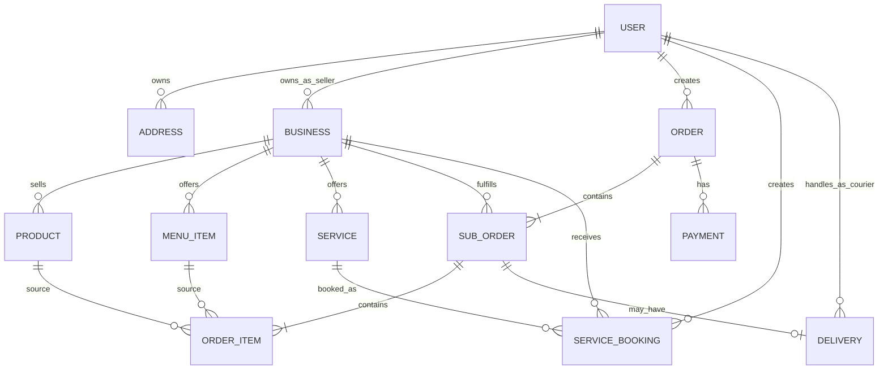
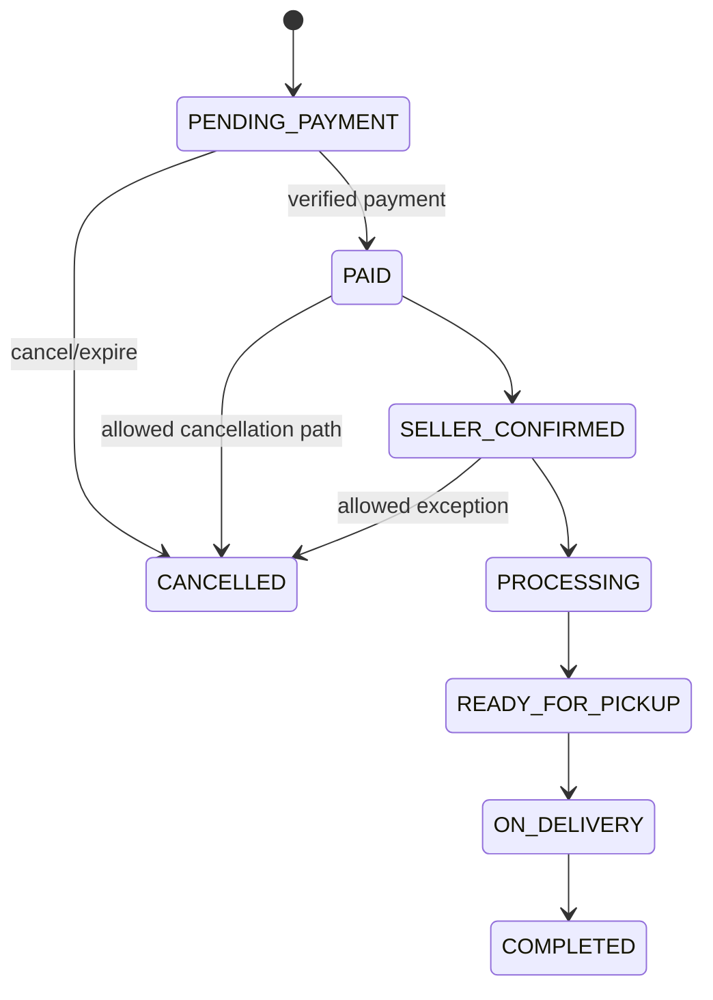
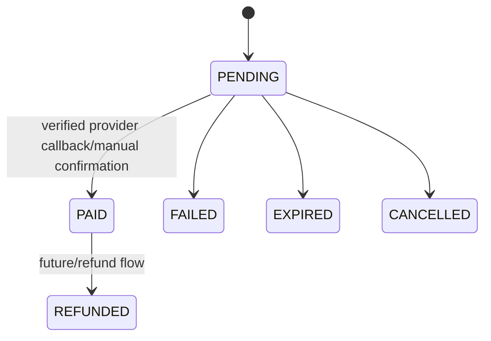
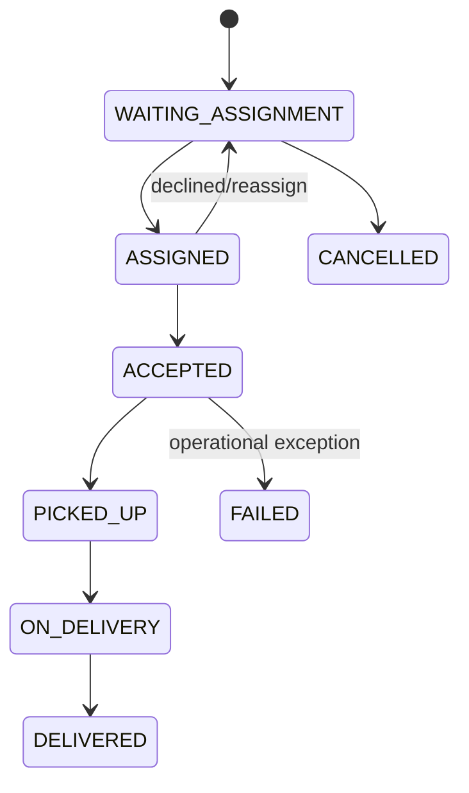
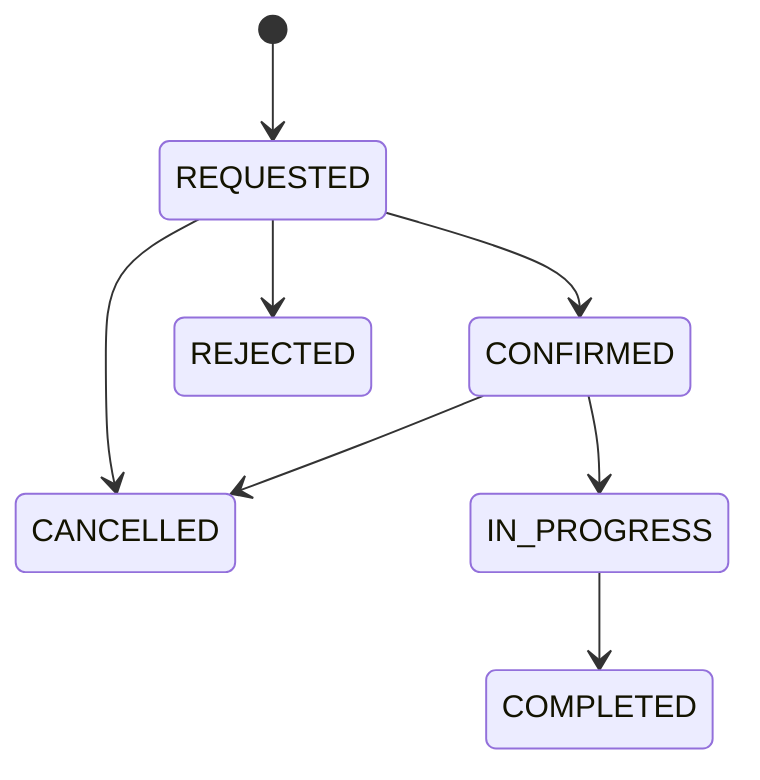

# Design & Technical Specification — PALUGADA Banjarsari

**Document Type:** Product Design + System Design
**Project:** PALUGADA Banjarsari
**Version:** 1.2
**Last Updated:** 29 September 2026

---

## 1. Design Objective

**Status implementasi terbaru:** pembaruan UI customer dan monitoring admin dengan akun uji lokal.
Bagian 2–32 tetap menjadi rancangan target, bukan klaim bahwa seluruh PRD sudah diimplementasikan.
Lihat bagian 34 untuk status terkini, forecasting, transaksi demo, dan akses LAN. Bagian 33 merupakan catatan tahap pertama dan digantikan oleh bagian 34 jika berbeda.

Dokumen ini menerjemahkan `PRD.md` menjadi rancangan UI/UX, system architecture, data model, route, state machine, integration boundary, dan developer ownership.

Prinsip utama:

1. Transformasi dilakukan bertahap dari existing catalogue app ke transactional marketplace.
2. Existing visual identity PALUGADA dipertahankan.
3. Transactional state tidak boleh bergantung pada client-only logic.
4. UI tidak boleh mengetahui detail persistence Firebase/PostgreSQL.
5. Domain Lukas, Zikri, dan Theo harus dapat berkembang paralel melalui contract yang jelas.
6. Mobile-first untuk customer flow.
7. WhatsApp tetap penting tetapi bukan source of truth.

---

## 2. Existing Technical Baseline

Snapshot repository yang diaudit menggunakan:

```text
Next.js 16.2.9
React 19.2.4
TypeScript 5
Firebase 12.15.0
firebase-admin 14.1.0
Lucide React
XLSX
Vanilla CSS / CSS Modules
```

Existing top-level patterns:

```text
app/
├── (davy)/         # public catalogue pages
├── (theo)/         # auth/admin pages
├── globals.css
└── layout.tsx

context/
├── AuthContext.tsx
└── FavoritesContext.tsx

lib/
├── firebase.ts
├── auth.ts
├── storage.ts
└── firestore/
    ├── analytics.ts
    ├── bisnis.ts
    ├── favorites.ts
    ├── jasa.ts
    ├── kategori.ts
    ├── produk.ts
    ├── reviews.ts
    ├── seo.ts
    └── types.ts
```

Current primary weakness untuk target baru adalah dominannya pola:

```text
Client Component → Firebase SDK → Firestore
```

Pola tersebut tidak boleh menjadi default untuk payment, order, inventory mutation, delivery, dan role-sensitive operation.

---

## 3. Visual Design System

Design system existing dari `agent.md` dipertahankan kecuali ada redesign yang disetujui.

### 3.1 Colors

| Token | Value | Usage |
|---|---|---|
| Primary | `#05472B` | CTA, header, primary action |
| Secondary | `#AADCAB` | secondary surface/highlight |
| Dark | `#013020` | dark background/footer |
| Accent | `#CDFF00` | highlight/status/accent |
| Aqua | `#00C0A3` | icon/active state |
| Black | `#000000` | text/high contrast |
| White | `#FFFFFF` | surface/background/text on dark |

Jangan menambah palette baru secara acak. Semantic states seperti error/warning/success sebaiknya didefinisikan sebagai design token resmi jika dibutuhkan dan disetujui, bukan hardcode per page.

### 3.2 Typography

- Heading: JetBrains Mono
- Body/UI: Plus Jakarta Sans

### 3.3 Layout

- mobile-first;
- 8px spacing system;
- maximum content width desktop yang konsisten;
- sticky bottom action diperbolehkan pada mobile checkout/product/detail;
- seller/admin dashboard dapat menggunakan sidebar desktop + compact navigation mobile.

### 3.4 UI Interaction Rules

Setiap async action harus memiliki:

- loading state;
- success state bila perlu;
- error message yang actionable;
- disabled state untuk mencegah duplicate submission;
- confirmation untuk destructive action.

---

## 4. Information Architecture

### 4.1 Public / Customer

Recommended route map:

```text
/
/katalog
/search
/bisnis
/bisnis/[id]
/produk/[id]
/makanan
/merchant/[id]
/menu/[id]
/jasa
/layanan/[id]
/cart
/checkout
/orders
/orders/[id]
/bookings
/bookings/[id]
/favorites
/profile
/profile/addresses
/login
/register
```

Existing route naming tidak wajib langsung dirombak. Migration harus menjaga URL existing atau memberi redirect bila ada perubahan.

### 4.2 Seller

```text
/seller
/seller/store
/seller/products
/seller/products/new
/seller/products/[id]
/seller/food
/seller/food/menu
/seller/services
/seller/orders
/seller/orders/[id]
/seller/bookings
/seller/analytics
/seller/settings
```

### 4.3 Courier

```text
/courier
/courier/deliveries
/courier/deliveries/[id]
/courier/history
/courier/profile
```

### 4.4 Admin

```text
/admin
/admin/users
/admin/sellers
/admin/couriers
/admin/orders
/admin/payments
/admin/deliveries
/admin/bookings
/admin/categories
/admin/moderation
/admin/analytics
/admin/settings
```

Admin CRUD katalog existing secara bertahap dipindahkan menjadi seller-owned workflow.

---

## 5. Key Screen Design

## 5.1 Home

Tujuan: mengarahkan user ke tiga layanan utama dan discovery lokal.

Section yang direkomendasikan:

1. Header/navigation.
2. Search bar utama.
3. Hero PALUGADA Banjarsari.
4. Tiga primary service cards:
   - Belanja Barang
   - Pesan Makanan
   - Cari Jasa
5. Produk populer.
6. Makanan/merchant populer.
7. Jasa populer.
8. UMKM lokal.
9. Footer.

Existing homepage tidak perlu dibuang; section baru dapat diintegrasikan bertahap.

## 5.2 Product Detail

Minimum content:

- gallery;
- product name;
- price;
- seller identity;
- stock/availability;
- variant bila ada;
- quantity selector;
- add to cart;
- buy now;
- WhatsApp seller secondary action;
- description;
- review.

Mobile action bar:

```text
[Chat WA] [Tambah Keranjang] [Beli]
```

## 5.3 Food Merchant

Minimum content:

- merchant info;
- open/closed;
- delivery context;
- menu category tabs;
- menu item cards;
- floating/current cart summary.

## 5.4 Service Detail

Minimum content:

- provider;
- service description;
- price type/range;
- availability;
- booking CTA;
- WhatsApp CTA;
- rating/review.

Primary action sebaiknya `Booking`, sementara WhatsApp tetap terlihat jelas sebagai secondary/contact action.

## 5.5 Cart

Cart dikelompokkan per seller:

```text
Seller A
[✓] Product A x2
[✓] Product B x1
Subtotal

Seller B
[✓] Product C x1
Subtotal

-----------------
Selected Total
[Checkout]
```

Cart harus menjelaskan item yang unavailable/out-of-stock dan mencegah silent checkout.

## 5.6 Checkout

Section:

1. Address/customer contact.
2. Group per seller.
3. Item summary.
4. Delivery/pickup option jika relevan.
5. Seller notes.
6. Payment method.
7. Cost breakdown.
8. Grand total.
9. Place order CTA.

## 5.7 Seller Dashboard

Dashboard seller tidak hanya angka traffic.

Top cards:

- penjualan periode aktif;
- order selesai;
- order perlu diproses;
- conversion indicator.

Sections:

- sales trend;
- top items;
- order funnel;
- recent orders;
- stock/availability attention;
- traffic & WhatsApp engagement.

## 5.8 Admin Dashboard

Top cards:

- sellers active;
- customers active;
- order volume;
- GMV;
- active deliveries/bookings;
- exception/dispute count.

Admin fokus pada ecosystem health, bukan seller day-to-day CRUD.

---

## 6. Target Architecture

### 6.1 Logical Architecture

```text
┌───────────────────────────────────────┐
│               Next.js UI              │
│ Customer | Seller | Courier | Admin   │
└───────────────────┬───────────────────┘
                    │
                    ▼
┌───────────────────────────────────────┐
│      Route Handler / Server Action    │
│     AuthN/AuthZ + request validation  │
└───────────────────┬───────────────────┘
                    │
                    ▼
┌───────────────────────────────────────┐
│          Application Services         │
│ Order | Payment | Delivery | Booking  │
│ Catalog | Analytics | User/Business   │
└───────────────────┬───────────────────┘
                    │
                    ▼
┌───────────────────────────────────────┐
│          Repository / Gateway         │
│ Firebase repos | Payment adapters     │
│ WhatsApp link | Analytics writer      │
└───────────────────┬───────────────────┘
                    │
                    ▼
┌───────────────────────────────────────┐
│          Current Infrastructure       │
│ Firebase Auth | Firestore | Storage   │
└───────────────────────────────────────┘
```

Future persistence:

```text
Repository interface
       │
       ├── Firebase implementation (now)
       └── PostgreSQL implementation (future VPS)
```

### 6.2 Rule

UI boleh membaca public catalogue melalui mechanism yang efisien, tetapi **mutation kritis** wajib melewati authoritative service boundary.

Critical mutations:

- create order;
- change order status;
- reserve/decrease stock;
- payment state;
- delivery assignment/status;
- service booking status;
- role/ownership changes.

---

## 7. Recommended Project Structure

Tidak wajib dipindahkan sekaligus. Ini target modular structure.

```text
app/
├── (public)/
├── (auth)/
├── seller/
├── courier/
├── admin/
└── api/

modules/
├── catalog/
│   ├── domain/
│   ├── application/
│   └── infrastructure/
├── orders/
├── payments/
├── delivery/
├── bookings/
├── analytics/
├── users/
└── businesses/

components/
├── ui/
├── commerce/
└── shared/

lib/
├── auth/
├── firebase/
├── validation/
└── integrations/

shared/
├── contracts/
├── types/
├── constants/
└── utils/
```

Jangan melakukan big-bang folder refactor. Module baru mengikuti structure target; code existing dipindahkan hanya saat disentuh dan aman.

---

## 8. Domain Ownership Map

```text
LUKAS / ADM
┌─────────────────────────┐
│ analytics               │
│ reporting               │
│ KPI/aggregation         │
│ seller insight          │
│ admin insight           │
└─────────────────────────┘

ZIKRI / ESD
┌─────────────────────────┐
│ web UI                  │
│ reusable UI             │
│ customer/seller UX      │
│ payment integration     │
│ payment presentation    │
└─────────────────────────┘

THEO / ERP
┌─────────────────────────┐
│ orders                  │
│ inventory rule          │
│ fulfillment             │
│ delivery/courier        │
│ service booking         │
│ operational workflow    │
└─────────────────────────┘
```

Shared area:

```text
shared/contracts
shared/types
role definitions
cross-domain event schema
```

Breaking shared change membutuhkan review lintas owner.

---

## 9. Core Data Model

Naming final dapat disesuaikan dengan existing convention. Yang penting adalah entity relationship dan ownership.

### 9.1 Users

```ts
type UserRole = 'customer' | 'seller' | 'courier' | 'admin';

interface User {
  id: string;
  email: string;
  role: UserRole;
  displayName: string | null;
  photoUrl: string | null;
  phone: string | null;
  isActive: boolean;
  createdAt: Date;
  updatedAt: Date;
}
```

### 9.2 Addresses

```ts
interface Address {
  id: string;
  userId: string;
  label: string;
  recipientName: string;
  phone: string;
  addressLine: string;
  areaName: string;
  latitude: number | null;
  longitude: number | null;
  notes: string | null;
  isDefault: boolean;
}
```

### 9.3 Businesses

```ts
type BusinessType = 'RETAIL' | 'FOOD' | 'SERVICE';

interface Business {
  id: string;
  ownerUserId: string;
  name: string;
  types: BusinessType[];
  description: string | null;
  address: string;
  whatsappNumber: string | null;
  logoUrl: string | null;
  isActive: boolean;
  operationalStatus: 'OPEN' | 'CLOSED' | 'PAUSED';
}
```

### 9.4 Retail Products

```ts
interface Product {
  id: string;
  businessId: string;
  categoryId: string;
  name: string;
  description: string | null;
  price: number;
  stock: number;
  sku: string | null;
  imageUrls: string[];
  isActive: boolean;
}
```

Variants dapat ditambahkan melalui child entity `ProductVariant` jika dibutuhkan.

### 9.5 Food Menu

```ts
interface MenuItem {
  id: string;
  businessId: string;
  menuCategoryId: string;
  name: string;
  description: string | null;
  price: number;
  imageUrl: string | null;
  isAvailable: boolean;
}
```

### 9.6 Services

Existing service model dapat diextend:

```ts
interface Service {
  id: string;
  businessId: string;
  categoryId: string;
  name: string;
  description: string | null;
  priceType: 'FIXED' | 'STARTING_FROM' | 'RANGE' | 'CONTACT_PROVIDER';
  minimumPrice: number | null;
  maximumPrice: number | null;
  availabilityType: string;
  isActive: boolean;
}
```

### 9.7 Cart

Cart dapat client-friendly tetapi server wajib revalidate price/stock saat checkout.

```ts
interface CartItem {
  id: string;
  customerId: string;
  itemType: 'PRODUCT' | 'FOOD';
  itemId: string;
  businessId: string;
  quantity: number;
  selectedVariantId: string | null;
}
```

### 9.8 Checkout / Order / Sub-order

Recommended hierarchy:

```text
Order (customer checkout level)
├── OrderGroup / SubOrder seller A
│   └── OrderItem snapshots
└── OrderGroup / SubOrder seller B
    └── OrderItem snapshots
```

```ts
interface Order {
  id: string;
  customerId: string;
  addressSnapshot: object;
  grandTotal: number;
  paymentMethod: string;
  paymentStatus: string;
  status: string;
  createdAt: Date;
}

interface SubOrder {
  id: string;
  orderId: string;
  businessId: string;
  vertical: 'RETAIL' | 'FOOD';
  subtotal: number;
  deliveryFee: number;
  status: string;
}

interface OrderItem {
  id: string;
  subOrderId: string;
  sourceItemId: string;
  itemType: 'PRODUCT' | 'FOOD';
  nameSnapshot: string;
  priceSnapshot: number;
  quantity: number;
  variantSnapshot: object | null;
  lineTotal: number;
}
```

### 9.9 Payments

```ts
interface Payment {
  id: string;
  orderId: string;
  method: 'CASH' | 'BANK_TRANSFER' | 'QRIS' | 'PAYMENT_GATEWAY';
  provider: string | null;
  providerReference: string | null;
  amount: number;
  status: 'PENDING' | 'PAID' | 'FAILED' | 'EXPIRED' | 'CANCELLED' | 'REFUNDED';
  paidAt: Date | null;
  createdAt: Date;
  updatedAt: Date;
}
```

### 9.10 Deliveries

```ts
interface Delivery {
  id: string;
  subOrderId: string;
  courierId: string | null;
  status:
    | 'WAITING_ASSIGNMENT'
    | 'ASSIGNED'
    | 'ACCEPTED'
    | 'PICKED_UP'
    | 'ON_DELIVERY'
    | 'DELIVERED'
    | 'FAILED'
    | 'CANCELLED';
  pickupAddressSnapshot: object;
  destinationAddressSnapshot: object;
  deliveryFee: number;
}
```

### 9.11 Service Bookings

```ts
interface ServiceBooking {
  id: string;
  customerId: string;
  businessId: string;
  serviceId: string;
  requestedAt: Date | null;
  locationSnapshot: object | null;
  notes: string | null;
  priceEstimate: number | null;
  status: 'REQUESTED' | 'CONFIRMED' | 'IN_PROGRESS' | 'COMPLETED' | 'CANCELLED' | 'REJECTED';
}
```

---

## 10. Entity Relationship Overview



Ini adalah conceptual ERD, bukan perintah untuk membuat seluruh collection sekaligus.

---

## 11. Order State Design

### 11.1 Order/Sub-order State



Exact cancellation rule dimiliki Theo dan harus mempertimbangkan payment/refund state.

### 11.2 Food-specific Operational States

Food dapat menggunakan operational state tambahan:

- `ACCEPTED`
- `PREPARING`
- `READY_FOR_PICKUP`

Mapping ke overall order status harus eksplisit.

---

## 12. Payment State Design



Rules:

- payment adapter menghasilkan provider request;
- provider callback masuk ke server endpoint;
- callback diverifikasi;
- update harus idempotent;
- service payment menerbitkan domain event/result untuk order service;
- browser redirect hanya presentation signal, bukan authoritative payment proof.

---

## 13. Delivery State Design



MVP boleh memulai courier assignment dari admin/system-assisted flow sebelum automatic dispatch dibangun.

---

## 14. Service Booking State Design



WhatsApp action tersedia setelah booking created dan tetap tersedia sesuai context.

---

## 15. API / Server Contract Principles

Endpoint exact dapat menyesuaikan Next.js Route Handler/Server Action, tetapi contract domain harus stabil.

Examples:

```text
POST   /api/orders
GET    /api/orders/:id
POST   /api/orders/:id/cancel
POST   /api/sub-orders/:id/status

POST   /api/payments
POST   /api/payments/webhook/:provider

POST   /api/bookings
POST   /api/bookings/:id/confirm
POST   /api/bookings/:id/status

POST   /api/deliveries/:id/accept
POST   /api/deliveries/:id/status

GET    /api/seller/analytics
GET    /api/admin/analytics
```

Rules:

- validate authentication;
- validate role;
- validate resource ownership;
- validate input;
- return predictable error shape;
- do not leak internal exception/secret;
- make critical write idempotent when applicable.

Suggested response envelope:

```ts
interface ApiResponse<T> {
  data?: T;
  error?: {
    code: string;
    message: string;
    fieldErrors?: Record<string, string>;
  };
}
```

---

## 16. Repository Interface Strategy

New critical modules should depend on interface/application service, not directly on `firebase/firestore` from UI.

Concept:

```ts
interface OrderRepository {
  createOrder(input: CreateOrderData): Promise<Order>;
  getOrderById(id: string): Promise<Order | null>;
  updateSubOrderStatus(id: string, status: SubOrderStatus): Promise<void>;
}
```

Current:

```text
FirestoreOrderRepository
```

Future:

```text
PostgresOrderRepository
```

Application service tetap sama.

---

## 17. Authentication & Authorization Design

### 17.1 Authentication

Firebase Auth tetap digunakan pada current phase.

### 17.2 Authorization

Authorization harus memeriksa role + ownership.

Examples:

```text
Customer
- read own orders/bookings
- create own checkout/booking

Seller
- manage business where ownerUserId == currentUser.id
- read/update sub-order for owned business

Courier
- read/update assigned delivery only

Admin
- platform monitoring/governance actions only
```

Client route guard hanyalah UX. Security tetap harus enforced pada server/rules.

---

## 18. Firebase Security Direction

Production tidak boleh bergantung pada test mode.

Security plan minimal:

1. public catalogue read sesuai active data;
2. user profile private write milik sendiri;
3. seller write dibatasi owner;
4. direct client write untuk transactional collections diminimalkan/dilarang;
5. payment state hanya server-authoritative;
6. admin claim/role tidak dapat dinaikkan dari client.

Rules harus berada di version control ketika sudah diterapkan, bukan hanya Firebase Console manual.

---

## 19. Payment Integration Adapter

Zikri mengimplementasikan provider melalui abstraction.

```ts
interface PaymentGateway {
  createTransaction(input: CreatePaymentInput): Promise<PaymentTransaction>;
  verifyWebhook(input: WebhookInput): Promise<VerifiedPaymentEvent>;
}
```

Application service tidak boleh mengetahui detail signature/vendor field lebih dari yang dibutuhkan.

Vendor selection dilakukan terpisah.

---

## 20. WhatsApp Integration Design

Tidak perlu WhatsApp Business API untuk MVP jika deep-link sudah memenuhi kebutuhan.

Flow:

```text
Order/Booking exists
      ↓
Generate safe message context
      ↓
Track WHATSAPP_CLICK
      ↓
Open wa.me / WhatsApp URL
```

Message tidak boleh berisi secret/payment credential.

Nomor harus dinormalisasi ke format yang dapat digunakan oleh WhatsApp.

---

## 21. Analytics Architecture — Lukas

### 21.1 Two Data Classes

**Transactional truth:**

- orders;
- payments;
- deliveries;
- bookings.

**Behavioral events:**

- views;
- add to cart;
- checkout started;
- WhatsApp click;
- funnel interaction.

KPI finansial harus berasal dari transactional truth, bukan semata event clickstream.

### 21.2 Event Shape

Recommended:

```ts
interface AnalyticsEventV2 {
  id: string;
  name: string;
  version: number;
  occurredAt: Date;
  userId: string | null;
  sessionId: string | null;
  businessId: string | null;
  entityType: string | null;
  entityId: string | null;
  orderId: string | null;
  metadata: Record<string, string | number | boolean | null>;
}
```

Avoid storing PII yang tidak diperlukan di analytics event.

### 21.3 Seller Analytics Query Boundary

Seller analytics harus selalu scoped by `businessId` yang seller miliki.

### 21.4 Platform Analytics

Admin dapat aggregate cross-business dengan permission yang sesuai.

---

## 22. Cross-Domain Contracts

### Payment → Order

Payment service boleh menghasilkan:

```ts
PAYMENT_CONFIRMED {
  orderId,
  paymentId,
  amount,
  paidAt
}
```

Theo menentukan effect terhadap order state.

### Order → Analytics

Order domain menghasilkan descriptive event seperti:

```ts
ORDER_CREATED
ORDER_COMPLETED
ORDER_CANCELLED
```

Lukas menentukan aggregation/KPI, bukan state transition order.

### Delivery → Order

Delivery domain menghasilkan delivery status event. Mapping ke order completion didefinisikan di business service Theo.

---

## 23. UI Component Boundaries

Recommended reusable components:

```text
Button
Input
Select
Modal
Drawer
Badge
Toast/Alert
EmptyState
LoadingState
ErrorState
ProductCard
MerchantCard
ServiceCard
PriceDisplay
QuantitySelector
CartSellerGroup
OrderStatusBadge
PaymentStatusBadge
DeliveryStatusBadge
MetricCard
ChartContainer
```

Shared component modification tidak boleh merusak page milik developer lain. Gunakan props backward-compatible atau coordinate breaking change.

---

## 24. Error and Edge Cases

Wajib didesain:

- item deleted setelah masuk cart;
- price berubah sebelum checkout;
- stock berkurang sebelum checkout;
- seller inactive;
- merchant closed;
- duplicate checkout submission;
- duplicate payment webhook;
- payment berhasil tetapi UI terputus;
- courier menolak assignment;
- seller menolak booking;
- WhatsApp number invalid;
- failed image upload;
- unauthorized role access;
- order dari multiple seller dengan status berbeda.

UI harus menampilkan state per seller/sub-order, bukan hanya satu status yang menyesatkan.

---

## 25. Testing Strategy

### 25.1 Unit Tests

Prioritas:

- order total calculation;
- multi-seller grouping;
- state transition validation;
- payment status mapping;
- delivery transition;
- booking transition;
- analytics KPI calculation.

### 25.2 Integration Tests

Prioritas:

- create order from cart;
- stock validation;
- payment callback → payment status → order state;
- seller authorization;
- courier authorization;
- booking → WhatsApp context;
- analytics event emission.

### 25.3 E2E Critical Path

At minimum:

1. customer login → product → cart → checkout → order;
2. seller login → view/confirm order;
3. payment sandbox/manual flow;
4. food order → courier flow → delivered;
5. service booking → provider confirmation → complete.

---

## 26. Performance Design

- paginate catalogue/admin tables;
- avoid analytics `limit(1000)` becoming permanent scaling strategy;
- derive/aggregate metrics when volume requires it;
- optimize images;
- prefer server rendering where useful;
- only use client components where interaction requires it;
- do not fetch whole collections for simple detail/list queries.

---

## 27. Observability

For critical server action log at minimum:

- request correlation/order ID;
- action name;
- actor role/id when safe;
- result;
- error code;
- provider reference for payment (non-secret).

Never log:

- password;
- token;
- secret key;
- raw payment credential.

---

## 28. Migration Strategy from Existing Code

### Step 1 — Stabilize

- document baseline;
- ensure Git tree clean/understood;
- confirm current build/lint;
- preserve working catalogue.

### Step 2 — Introduce New Roles

Migrate `pelanggan` → `customer` with backward compatibility during transition.

### Step 3 — Introduce Ownership

Add `ownerUserId` / seller ownership relation to business.

### Step 4 — Introduce Server Boundary

New critical mutations use service/API layer first. Existing public reads can remain temporarily.

### Step 5 — Build Transactional Domains

Order/payment/delivery/booking are created as new modules rather than stuffed into old product helper files.

### Step 6 — Move Seller CRUD

Existing admin CRUD capabilities that are seller responsibilities move to seller dashboard.

### Step 7 — Expand Analytics

Existing event system becomes V2/extended while preserving historical compatibility where feasible.

### Step 8 — VPS Readiness

Once domain contracts are stable, implement persistence migration plan to PostgreSQL.

---

## 29. Branch and File Safety

Long-lived branch ownership:

```text
lukas → Lukas
zikri → Zikri
theo  → Theo
```

No developer/agent may:

- checkout another developer branch and commit there without explicit instruction;
- merge another developer branch directly;
- reset/rebase shared branch destructively;
- delete unrelated files to “clean” the project;
- auto-resolve conflicts by discarding unknown work;
- auto-push unless explicitly requested.

Integration path uses `develop` then `main`.

---

## 30. Repository Baseline Warning

Pada snapshot yang diaudit, Git menunjukkan beberapa file tracked di folder `UI Katalog v1/` sebagai deleted. Ini harus diperlakukan sebagai **pre-existing working-tree condition** sampai dipastikan.

Agent/developer tidak boleh:

- commit deletion tersebut secara tidak sengaja;
- restore/overwrite tanpa memahami baseline;
- menggunakan kondisi tersebut sebagai alasan melakukan mass cleanup.

Sebelum implementation besar, status baseline harus diselesaikan dan disepakati.

---

## 31. Do Not Do

- Jangan membuat semua domain dalam satu file helper Firestore besar.
- Jangan menaruh secret payment di `NEXT_PUBLIC_*`.
- Jangan mempercayai role dari browser untuk authorization.
- Jangan menjadikan analytics event sebagai sumber payment truth.
- Jangan menjadikan WhatsApp sebagai satu-satunya histori order.
- Jangan melakukan big-bang Firebase → PostgreSQL migration sebelum domain stabil.
- Jangan memindahkan semua folder existing hanya demi mengikuti target structure.
- Jangan mengubah UI palette/font tanpa keputusan design.
- Jangan menambahkan library besar jika native/stack existing sudah cukup.
- Jangan mengerjakan domain developer lain tanpa contract/review.

---

## 32. Design Principle Summary

> **UI dibuat familiar dan mobile-first; state transaksi authoritative di server/service layer; data ownership mengikuti seller/customer/courier; analytics membaca fakta transaksi tanpa mengendalikan business process; dan arsitektur disusun agar Firebase dapat diganti kemudian tanpa menulis ulang keseluruhan aplikasi.**

---

## 33. Implemented UI & Local Preview — 29 September 2026

### 33.1 Scope and ownership

ACTIVE_DEVELOPER = `lukas`. Scope yang dipilih user: tampilan customer, monitoring admin,
penyesuaian desain, dan akun uji lokal. Perubahan UI lintas domain dilakukan sesuai permintaan
eksplisit ini. Tidak ada perubahan lifecycle order, stock reservation, payment gateway,
courier assignment, maupun mutation booking milik Theo/Zikri.

### 33.2 Customer experience

- Beranda: hero pencarian, tiga pintu discovery (produk, makanan, jasa), pilihan katalog,
  dan profil usaha warga. Warna hijau PALUGADA, JetBrains Mono, dan Plus Jakarta Sans dipertahankan.
- `/katalog`: pencarian nama/deskripsi/usaha, kategori, wilayah, ketersediaan, urutan nama/harga/popularitas,
  status kosong, dan tautan detail. Query lama `type`, `q`, `search`, `keyword` tetap diterima.
- `/makanan` dan `/jasa`: halaman discovery khusus vertical; food saat ini dipetakan dari
  kategori katalog existing dengan slug `makanan`, `makanan-minuman`, atau `food`.
  Ini klasifikasi tampilan, bukan implementasi menu, stok, jam buka, ongkir, atau fulfillment.
- `/favorites`: favorit per akun pada localStorage browser melalui helper existing.
- `/produk/[id]` dan `/layanan/[id]`: pada mode lokal memakai detail pratinjau;
  checkout/booking dinonaktifkan dengan alasan yang terlihat. Tidak membuat order palsu.
  Detail Firebase existing tetap dipakai ketika mode lokal mati.
- `/orders` dan `/bookings`: riwayat contoh dibatasi server ke UID pemilik akun.
- `/login`, `/register`, `/profile`: mode lokal memakai akun uji yang telah disiapkan;
  pendaftaran dan perubahan profil lokal belum tersedia. Integrasi Firebase existing
  tetap tersedia di luar mode lokal. Login tidak lagi menjalankan seeder admin otomatis.

Header menyediakan navigasi produk/makanan/jasa/usaha, favorit, aktivitas, profil,
dashboard untuk admin, logout, dan navigasi mobile. Footer mengarah ke rute yang tersedia.
Banner global menandai bahwa data lokal adalah contoh dan transaksi belum aktif.

### 33.3 Admin monitoring

| Route | Implementasi |
|---|---|
| `/admin` | KPI, tren GMV harian, kesehatan pesanan, ranking usaha, ringkasan delivery/booking, daftar pesanan |
| `/admin/orders` | Pencarian, filter status, periode 7/30 hari, rincian snapshot item, ekspor CSV |
| `/admin/payments` | Status pembayaran per pesanan, metode dan rincian, filter status |
| `/admin/deliveries` | Status pengantaran dan identitas kurir contoh |
| `/admin/bookings` | Jadwal WIB, provider, estimasi, status booking |
| `/admin/sellers` | Daftar seller, usaha, status akun |
| `/admin/users` | Customer dan kurir beserta status akun |
| `/admin/engagement` | Dashboard Firestore engagement lama, dipertahankan untuk mode Firebase |

Navigasi utama admin berfokus pada monitoring. Rute CRUD lama tetap ada untuk kompatibilitas,
tetapi tidak dijalankan pada mode lokal. Pemindahan authorization CRUD ke seller dan integrasi
monitoring produksi masih pekerjaan berikutnya. Pada mode Firebase, monitoring baru menampilkan
pesan sumber data belum terhubung; tidak menampilkan fixture sebagai data produksi.

Data monitoring contoh konsisten pada snapshot **28 September 2026, 17:00 WIB**.
Filter 7/30 hari relatif terhadap snapshot, bukan tanggal jam perangkat.
Pesanan/pembayaran/pengantaran mengikuti periode; jumlah akun aktif dan booking memakai
seluruh snapshot dan diberi label demikian. Klik ID pesanan membuka rincian inline.

### 33.4 KPI definitions

- GMV terbayar = jumlah `total` pesanan dengan payment `PAID` dan status bukan `CANCELLED`.
  `PENDING`, `FAILED`, dan `REFUNDED` tidak dihitung. GMV bukan laba atau pendapatan platform.
- Average paid order = GMV / jumlah pesanan yang masuk GMV; nol bila tidak ada data.
- Completion rate = pesanan `COMPLETED` / seluruh pesanan periode.
- Cancellation rate = pesanan `CANCELLED` / seluruh pesanan periode.
- Active orders = selain `COMPLETED` dan `CANCELLED`.
- Ranking usaha dan grafik memakai definisi GMV yang sama.

Adapter fixture saat ini memakai satu seller per baris order untuk demonstrasi monitoring.
Ini **bukan** model final multi-seller checkout: integrasi produksi perlu adapter Order/SubOrder
yang mencegah double counting, mendefinisikan shipping/refund, dan direview owner domain.
Analytics hanya membaca data; tidak mengubah payment atau order state.

### 33.5 Local account and API boundary

```text
Local UI → /api/local/session → signed HttpOnly cookie
Admin UI → /api/local/monitoring → server role check → read-only fixtures
Customer UI → /api/local/activity → server UID filter → own fixture history
```

`lib/server/preview-session.ts` hanya menerima request localhost/127.0.0.1 dan memerlukan
`NODE_ENV=development` serta `NEXT_PUBLIC_LOCAL_PREVIEW=true`. API lokal menghasilkan 404
di production, bahkan bila flag preview terbawa. POST/DELETE memeriksa same-origin.
Cookie menggunakan HMAC-SHA256, HttpOnly, SameSite=Strict, expiry 8 jam. Identitas/peran
ditentukan di server, tidak diterima dari form atau localStorage. Logout menghapus cookie;
ini sesi lokal stateless, bukan sistem revocation production.

`GET /api/local/monitoring` menghasilkan 401 tanpa sesi dan 403 untuk customer.
`GET /api/local/activity` selalu memfilter customerId di server. Semua response tidak di-cache.
Preview menggunakan konfigurasi Firebase dummy; pembacaan katalog/review/SEO dan event/favorit
yang digunakan layar preview tidak mengirim request Firestore. Kontak contoh pada profil usaha
dinonaktifkan. Tidak ada seed akun/data pada Firebase production.

### 33.6 Running locally

```powershell
npm ci
npm run setup:local
npm run dev:local
```

Buka `http://127.0.0.1:3000` atau `http://localhost:3000`.
`setup:local` membuat `.env.local` dan `.local/accounts.json`; keduanya diabaikan Git.
Script menolak menimpa `.env.local` existing. Jika sudah ada, atur variabel berikut secara manual:

| Variable | Purpose |
|---|---|
| `NEXT_PUBLIC_LOCAL_PREVIEW=true` | Mengaktifkan UI fixture lokal; bukan secret |
| `LOCAL_SESSION_SECRET` | Secret server acak minimal 32 karakter |
| `LOCAL_ADMIN_PASSWORD` | Kata sandi acak admin lokal |
| `LOCAL_CUSTOMER_PASSWORD` | Kata sandi acak customer lokal |
| `NEXT_PUBLIC_SITE_URL=http://localhost:3000` | URL metadata lokal |

Email uji: `admin@palugada.local` dan `user@palugada.local`. Password dihasilkan acak
oleh script dan hanya disimpan lokal. Gunakan `/login` untuk keduanya. Akun admin menuju
`/admin`, customer menuju `/`. Tidak ada credential yang ditambahkan ke source control.
Matikan flag dan lengkapi environment Firebase sebelum memakai mode produksi.

### 33.7 Validation and follow-up

- `npm run test:monitoring`: definisi GMV, empty state, serta batas periode WIB.
- `npm run test:local-api`: jalankan ketika server lokal aktif; memeriksa login, password salah,
  origin, cookie, admin RBAC, kepemilikan riwayat, pemalsuan sesi, dan logout.
- `npx tsc --noEmit`, `npm run build`, dan lint kode baru.
- Uji browser desktop/mobile: navigasi, login kedua role, filter katalog, favorit,
  periode/filter monitoring, rincian pesanan, serta penolakan halaman admin untuk customer.

Lint seluruh repositori masih memiliki pelanggaran pada kode baseline; tidak dilakukan
refactor di luar scope. Lockfile diperbaiki untuk dua peer dependency transitif yang hilang
(`@emnapi/core`, `@emnapi/wasi-threads`), tanpa mengganti framework atau dependency utama.
Tools browser sementara berada di `.local/`, bukan dependency aplikasi.

Hasil verifikasi 29 September 2026: build production dan TypeScript lulus; tiga unit test
monitoring lulus; pemeriksaan API lokal lulus; lint seluruh kode baru lulus; uji Chrome
1440px dan 390px lulus tanpa page error dan tanpa overflow horizontal halaman.
Lint keseluruhan repository masih melaporkan 34 error dan 19 warning pada kode legacy.
Screenshot dan laporan lint lokal tersedia di `.local/` (tidak masuk Git).

Belum diimplementasikan: mutation cart/checkout, payment provider, booking creation,
seller/courier operation, production monitoring repository, migrasi role Firebase,
dan review terverifikasi transaksi. Tidak ada migration database pada perubahan ini.

---

## 34. Marketplace, transaksi demo, analisis, dan LAN (v1.2)

Bagian ini menggantikan batas implementasi tahap pertama pada bagian 33. Rancangan produksi bagian 2–32 tetap menjadi target. User secara eksplisit meminta perbaikan customer/admin, fungsi demo, forecasting, akses HP, dan push branch lukas; scope lint/security juga diperluas untuk audit.

### 34.1 Struktur layar dan identitas visual

Identitas PALUGADA tetap memakai token hijau #05472B, #AADCAB, #013020, #CDFF00, #00C0A3, hitam/putih, JetBrains Mono untuk heading dan Plus Jakarta Sans untuk body. Permukaan memakai tint dari token. Ilustrasi produk berbasis CSS/SVG diberi label ilustrasi.

- Header marketplace: brand, kolom pencarian utama, favorit, keranjang dengan jumlah item, akun; navigasi kategori di bawah.
- Beranda: banner ringkas, kategori, grid produk dengan harga dan toko, layanan jasa, pintasan profil usaha.
- HP: grid dua kolom dan bottom navigation Beranda/Katalog/Keranjang/Pesanan/Akun. Login menempatkan formulir langsung di layar, tanpa panel promosi desktop. Input 16px, autofill username/current-password, tampilkan/sembunyikan sandi.
- Detail produk menunjukkan stok demo, tombol tambah, tautan keranjang, favorit, identitas toko. Detail jasa menyediakan jadwal, alamat layanan, dan catatan.
- Keranjang berkelompok per seller; checkout menunjukkan total dan pilihan ambil di toko/tunai demo. State loading/error/empty/success tersedia.
- Admin memakai sidebar desktop/drawer HP, KPI, insight deskriptif, tren, performa toko, daftar aktivitas, pencarian/filter/ekspor CSV, dan menu Forecasting stok. Admin tetap monitoring; tidak menggantikan seller.

### 34.2 Kontrak transaksi development

| Area | Kontrak lokal |
|---|---|
| Cart | CartLine { productId, quantity } pada localStorage per UID; harga bukan otoritas client |
| Checkout | CheckoutInput { items, address, phone, note, idempotencyKey } |
| Hasil | Satu MonitorOrder per seller, shared checkoutId, snapshot item/harga, AWAITING_SELLER, payment PENDING, delivery PICKUP |
| Booking | serviceId, schedule ISO, address, notes, idempotencyKey; hasil REQUESTED; jadwal masa depan hingga 90 hari |
| Persistence | .local/commerce.json: stock, orders, bookings, requests; atomic rename dan exclusive file lock |
| Pembatalan | Pemilik order, hanya sebelum konfirmasi; idempotent; restore stok; order/payment/delivery menjadi CANCELLED |

POST /api/local/commerce memiliki action checkout/cancel/booking, otorisasi customer, validasi origin, body limit, harga dari katalog server, stok nonnegatif, penggabungan item duplikat, dan idempotensi per UID/action/key. GET memberi stok publik demo. Activity memfilter UID di server; monitoring menggabungkan transaksi demo dengan fixture. Uji API meninggalkan order dibatalkan dan booking berlabel otomatis untuk jejak pengujian.

Pola ini tidak mendefinisikan kontrak produksi lintas tim. Shipping, payment gateway, seller acceptance, courier assignment, refund, dan aturan Firestore transaksi tetap perlu integrasi domain ERP/ESD. Tidak ada uang atau pesan WhatsApp yang dikirim.

### 34.3 Insight dan forecasting

Monitoring menampilkan pembayaran tertunda (selain dibatalkan), rasio pembatalan, konsentrasi GMV seller, dan tautan peninjauan. Insight tidak mengklaim sebab-akibat. Periode/grafik dihitung menurut kalender WIB. Ini nilai pembelian customer/penjualan seller; data biaya supplier belum ada sehingga laba/margin tidak ditampilkan.

Sumber forecasting:
1. Dataset contoh deterministik 56 hari, empat produk, tanggal acuan 2026-09-28; jelas terpisah dari fixture order.
2. CSV admin berisi product_id, product_name, kind (RETAIL/FOOD), unit, date, quantity, on_hand, incoming, lead_days, review_days, shelf_life_days.

CSV dibatasi 1 MB, 20.000 baris, 100 produk. Metadata produk harus konsisten. Kuantitas/stok berupa bilangan bulat nonnegatif; makanan wajib umur simpan positif. Satu observasi per produk/hari. Tanggal hilang tidak dianggap nol. Minimal 28 hari lengkap sampai tanggal acuan; maksimal 56 hari terakhir dipakai. Histori duplikat/tidak valid/masa depan ditolak untuk rekomendasi.

Empat kandidat: rata-rata 7 hari, rata-rata sampai 28 hari, pola mingguan (lag 7), dan exponential smoothing alpha 0,3. Empat belas hari terakhir dievaluasi dengan rolling one-step forecast menggunakan observasi sebelum hari uji. Pilih MAE terendah; laporkan MAE dan WAPE (null bila total aktual nol). Forecast multi-hari bersifat rekursif dan belum divalidasi sebagai multi-step; skor adalah skor pemilihan model, bukan estimasi akurasi independen atau jaminan.

Rumus:
- Hari rencana barang = leadDays + reviewDays (maksimal 30).
- Hari rencana makanan = minimum(hari rencana, shelfLifeDays).
- Target = ceil(jumlah prediksi hari rencana + buffer).
- Buffer barang = ceil(MAE × sqrt(hari rencana)); buffer makanan = 0.
- Tambahan = max(0, target − stok layak jual − incoming tepat waktu).
- Coverage memakai stok saat ini / rata-rata demand prediksi tujuh hari.
- Risk low jika pasokan kurang dari demand; excess jika pasokan >1,5 × target (atau demand nol tetapi stok ada); selainnya healthy. Saran tambahan dapat muncul untuk buffer sebelum risk low.

Umur simpan membatasi saran persiapan, bukan model keamanan pangan. Operator tetap harus mengecek batch layak jual, waktu pasokan, dan kapasitas produksi. Belum ada BOM/resep, promosi, cuaca, distribusi ketidakpastian, dan koreksi stockout/lost sales. Tidak ada pembelian/produksi otomatis. Impor dianalisis server hanya untuk sesi halaman dan tidak disimpan.

### 34.4 Akun dan jaringan lokal

Ikuti README.md: setup:local (sekali), setup:lan, dev:lan. Akun demo mudah: admin / Admin123!, user / User123!. Alias email tetap berlaku. Password demo bukan credential Firebase. Secret HMAC dihasilkan acak dan hanya berada di .env.local yang diabaikan Git.

setup:lan memperbarui allowlist alamat IPv4 perangkat, menyetel password demo, dan merotasi secret (logout sesi lama). Jalankan ulang bila IP Wi-Fi berubah lalu restart server. API menerima localhost/127.0.0.1 dan host allowlist persis; POST/DELETE harus Origin yang sesuai Host. Mode ini tetap khusus NODE_ENV development. Lima API lokal terbukti mengembalikan 404 saat production start. Login dibatasi 20 kegagalan/menit per identitas demo dalam proses server.

VS Code: .vscode/tasks.json menyediakan task dev:lan dan firewall Administrator; launch.json membuka Edge; settings.json memberi label port 3000. Server listen 0.0.0.0:3000, URL Wi-Fi saat verifikasi http://192.168.0.103:3000. Firewall LocalSubnet membutuhkan hak Administrator; percobaan UAC dibatalkan sehingga belum ada aturan yang dibuat. Private cloud port forwarding memerlukan aksi Ports/sign-in pengguna; belum dibuat tunnel atau public URL.

### 34.5 Audit dan dependensi

Lihat AUDIT.md untuk matriks perbaikan, pengujian, keterbatasan, dan referensi. Next.js serta eslint-config-next diperbarui ke 16.3.6; SheetJS ke 0.20.3 dari distribusi resmi; dependency transitif kompatibel diperbarui sampai npm audit melaporkan 0 vulnerabilities. Font/palette dan stack utama tetap dipertahankan.
